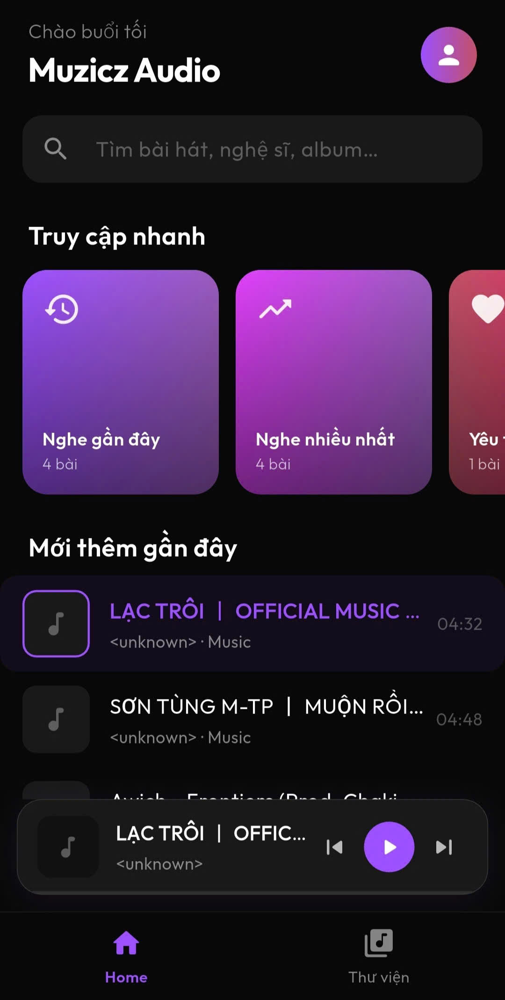
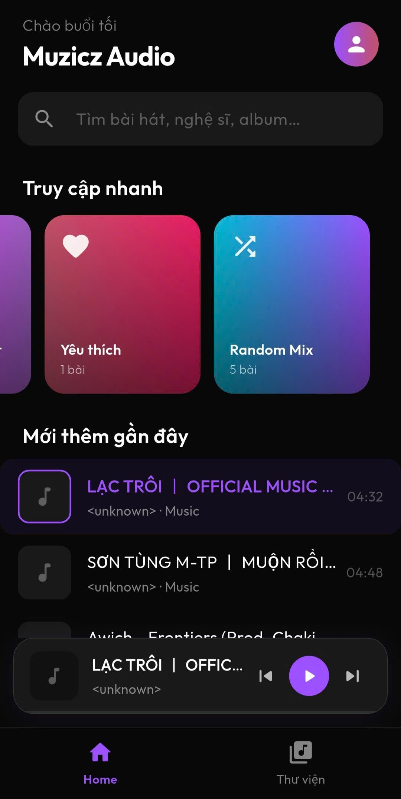
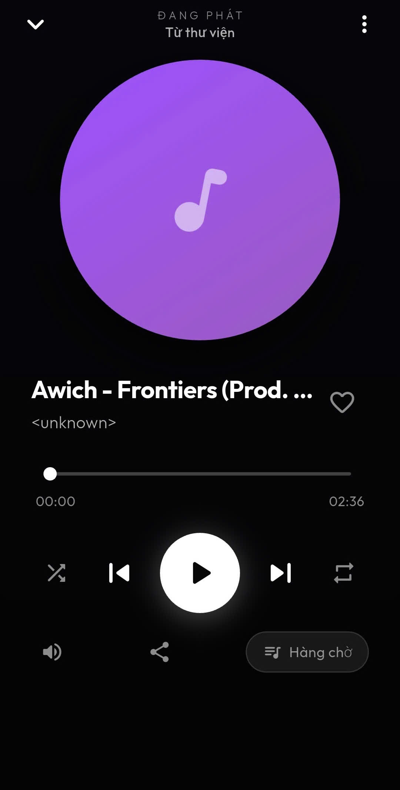
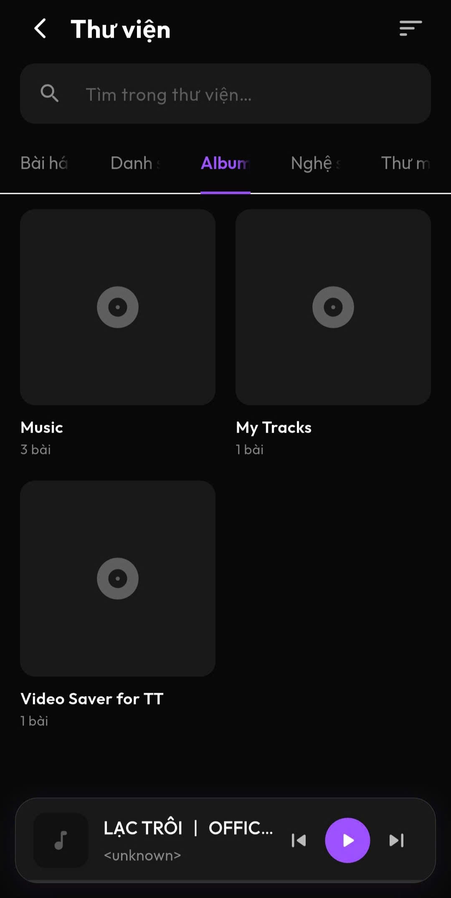
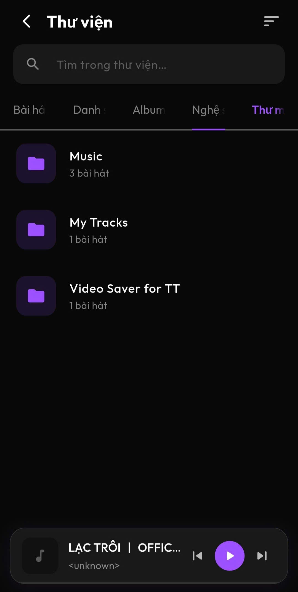
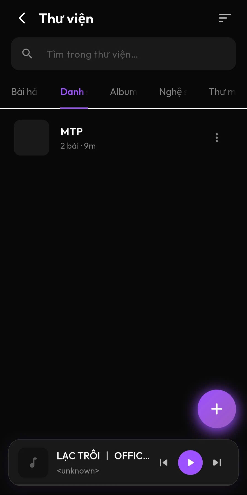
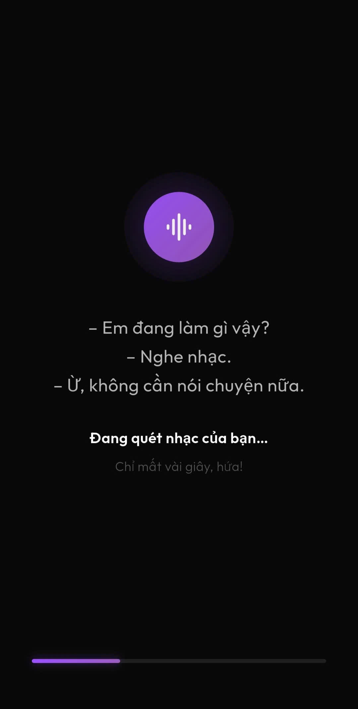
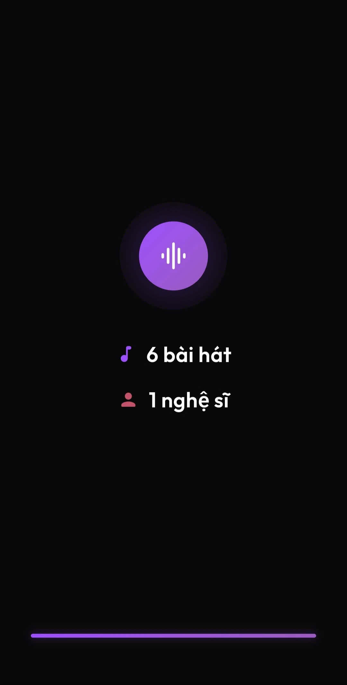
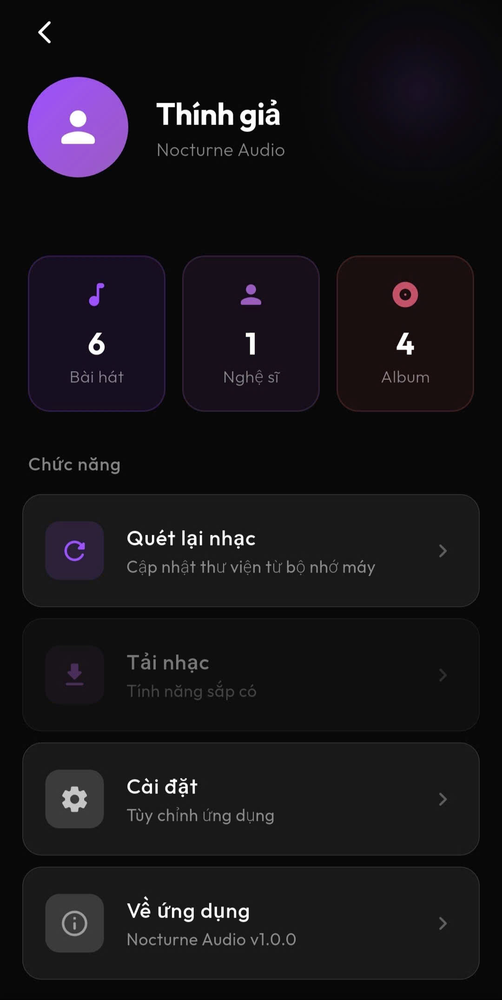
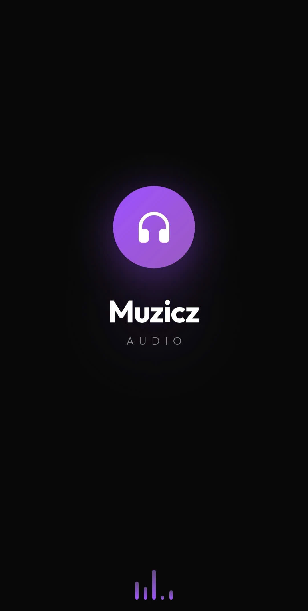

🎧 Muzicz – Flutter Music Player App
### 📱 Overview
Muzicz is a modern mobile music player application built with Flutter, designed to provide a smooth and intuitive music listening experience. The app focuses on clean UI, responsive performance, and efficient local music management.
This project demonstrates my ability to build a complete mobile application, including UI design, state management, and interaction with device storage.

### ✨ Features
- Play local audio files from device storage
- Browse songs with a clean and user-friendly interface
- Audio playback controls (play, pause, next, previous)
- Playlist / music list display
- Mini player for quick control
- Fast loading and smooth UI performance

### 🛠️ Tech Stack
- Framework: Flutter
- Language: Dart
- State Management: Provider
- Audio Handling: on_audio_query
- UI: Material Design + custom components

### 🧱 Architecture
The application follows a modular and scalable structure, separating concerns into:
- screens/ – UI screens (Home, Playlist, etc.)
- providers/ – State management logic
- models/ – Data models
- widgets/ – Reusable UI components
- theme/ – App styling and colors
==> This structure helps maintain clean code and makes the app easier to scale and maintain.

### 📱 App Preview
A quick look at the main features and UI of the application:
🏠 Home Screens

  
  

🎧 Audio Player

  

📂 Music Library & Browsing

  
  
  

🔍 Scanning & Processing

  
  

👤 User & App Screens

  
  

### 🧠 What I Learned
Building real-world mobile UI with Flutter
Managing app state effectively using Provider
Working with device media and local storage
Structuring scalable Flutter projects
Improving performance and user experience
- Future Improvements
- Search functionality
- Favorite songs feature
- Cloud sync / online streaming
- Advanced UI animations

### 👤 Author
GitHub: https://github.com/Khanq91

### ⭐ Final Note
This project is part of my journey in mobile development, where I continuously explore better ways to build performant and user-friendly applications.