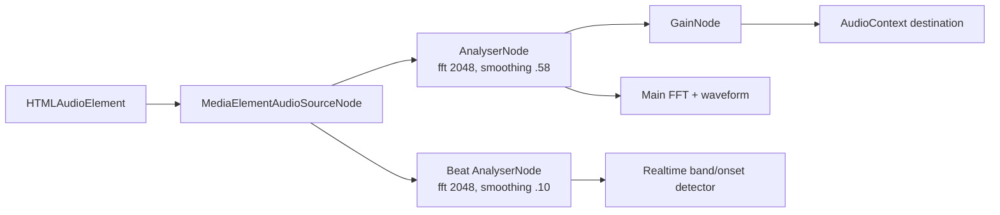
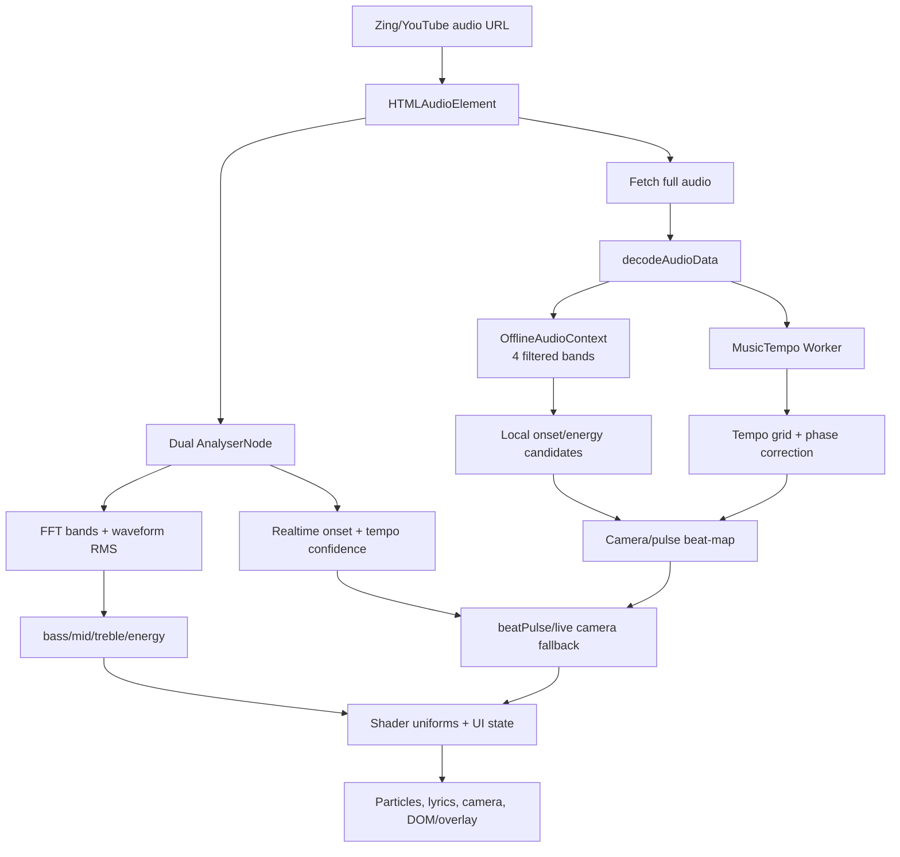
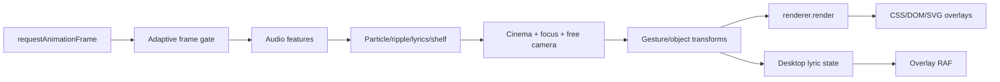
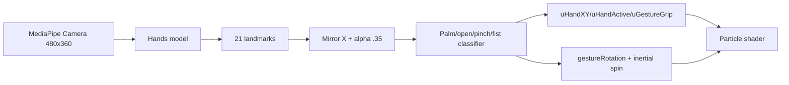
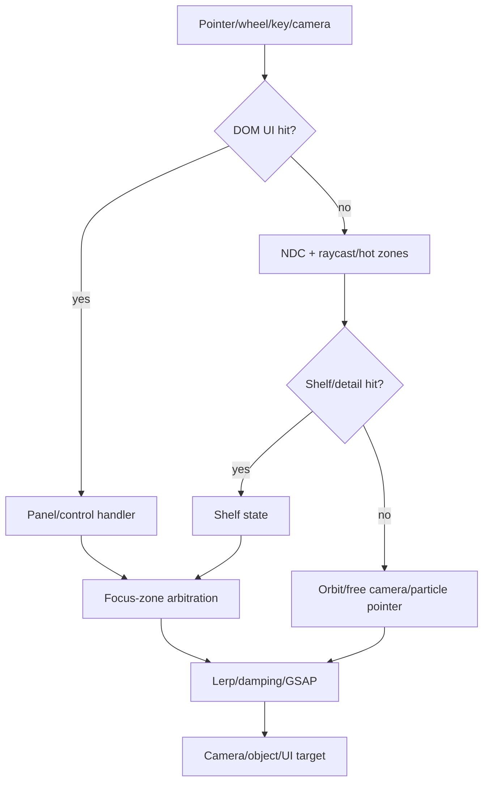

# Music Visual Forensic Analysis

## Document Metadata

- Project: Wavez 1.1.1
- Analysis date: 2026-07-23
- Current commit: `a13ad25635f6daba67af4aaad13a2f95c4c6d618`
- Current branch: `main`
- Upstream: `https://github.com/XxHuberrr/Mineradio`
- Analysis method: static source inspection bằng `rg`, đọc range có line number, kiểm kê dependency/vendor, và Git history cục bộ.
- Runtime availability: source và dependency cục bộ khả dụng; không khởi chạy Electron trong phiên phân tích này.
- Profiler availability: không dùng Chromium Performance, Memory, WebAudio hoặc Three.js renderer profiler.
- Webcam availability: implementation được đọc tĩnh; không xin quyền camera và không chạy MediaPipe.
- Main limitations: chưa đo FPS/CPU/GPU/memory, chưa quan sát camera thật, chưa so diff trực tiếp với checkout upstream, và line number sẽ dịch chuyển khi monolith thay đổi.

## Table of Contents

1. [Executive Summary](#1-executive-summary)
2. [Ground Truth and Analysis Boundaries](#2-ground-truth-and-analysis-boundaries)
3. [Project and Runtime Architecture](#3-project-and-runtime-architecture)
4. [Technology Inventory](#4-technology-inventory)
5. [Audio Pipeline](#5-audio-pipeline)
6. [Render Architecture](#6-render-architecture)
7. [Interaction Architecture](#7-interaction-architecture)
8. [Visual Subsystem Dossiers](#8-visual-subsystem-dossiers)
9. [Audio-Reactivity Matrix](#9-audio-reactivity-matrix)
10. [Lyrics Pipeline](#10-lyrics-pipeline)
11. [Three.js and WebGL Technique Catalogue](#11-threejs-and-webgl-technique-catalogue)
12. [Animation and Perceived-Quality Techniques](#12-animation-and-perceived-quality-techniques)
13. [Performance and Fragility Analysis](#13-performance-and-fragility-analysis)
14. [Feasibility and Reusability Matrix](#14-feasibility-and-reusability-matrix)
15. [Learning Roadmap Based on This Project](#15-learning-roadmap-based-on-this-project)
16. [Upstream Comparison](#16-upstream-comparison)
17. [Unknowns and Verification Plan](#17-unknowns-and-verification-plan)
18. [Key Findings Ranked by Learning Value](#18-key-findings-ranked-by-learning-value)
19. [Code Index](#19-code-index)
20. [Final Conclusions](#20-final-conclusions)

## 1. Executive Summary

Wavez có một hệ music visual thực sự đọc dữ liệu audio, không chỉ chạy animation khi bài hát bắt đầu. Một `HTMLAudioElement` được nối tới hai `AnalyserNode`: analyser chính có smoothing `0.58` để cấp FFT/waveform cho visual, analyser beat có smoothing `0.10` để giữ transient. Main loop đọc cả frequency và time-domain, chuẩn hóa động theo peak, chia dải bass/mid/treble, tạo envelope, rồi đẩy vào uniform shader `uBass`, `uMid`, `uTreble`, `uBeat`, `uEnergy`.

Beat/camera dùng kiến trúc hybrid:

- realtime onset detector theo các band 38–9200 Hz, attack/release time constant, spectral rise/flux, voice masking, threshold, cooldown và tempo confidence;
- offline analysis tải/decode cả track, render bốn band bằng `OfflineAudioContext`, lấy RMS theo cửa sổ 10 ms, kết hợp `MusicTempo` chạy trong Worker, hiệu chỉnh phase và sinh `cameraBeats`/`pulseBeats`;
- khi beat-map chưa sẵn sàng, realtime detector chỉ làm fallback có gate khá chặt.

Visual trung tâm là một `THREE.Scene`, một `PerspectiveCamera` và một `WebGLRenderer`. Particle cover dùng `BufferGeometry`, custom `ShaderMaterial`, texture cover/depth/ripple và nhiều uniform. Bloom không dùng post-processing: nó là pass hình học thứ hai bằng `THREE.Points`/additive material trong cùng scene. Lyrics 3D là `CanvasTexture` trên plane, thêm glow/readability/spark layers và được neo theo `camera.quaternion` hoặc skull mouth transform. Playlist shelf/detail cũng dùng canvas-textured planes, raycasting, render-order và windowing giới hạn số card/row hiện diện.

Webcam/device camera là implementation thật, không phải nhãn UI: MediaPipe Hands được tải động, camera frame đi qua 21 landmarks, mirror + smoothing, sau đó open hand/pinch/fist điều khiển particle repulsion, rotation/inertia và grip shader. Không tìm thấy face/body tracking, TensorFlow.js, optical flow hoặc custom pixel motion detector.

Điểm học tập lớn nhất là cách project phối hợp nhiều lớp nhỏ: normalization động, attack/release, camera composition, render ordering, input arbitration, transition interruption và fallback. Điểm khó tái sử dụng nhất là global state trong monolith và hệ tọa độ chung giữa camera, particle, lyrics, shelf.

**Evidence**

- File: `public/index.html`
- Symbol: `initAudio()`, `processRealtimeBeatEngine()`, `animate()`
- Lines: `17745–17765`, `4444–4633`, `26759–27015`
- Status: `CONFIRMED`
- Finding: Hai analyser cấp FFT/waveform, realtime beat và uniform visual trong main frame loop.

**Evidence**

- File: `public/index.html`
- Symbol: `analyzeAudioBeats()`
- Lines: `10443–11194`
- Status: `CONFIRMED`
- Finding: Offline multi-band RMS + MusicTempo worker tạo beat-map có phase correction.

## 2. Ground Truth and Analysis Boundaries

### 2.1 Files inspected

- `AGENTS.md`
- `docs/memory/STATE.md`, `DECISIONS.md`, `RISKS.md`, `CODE_MAP.md`
- ba entry mới nhất của `docs/memory/SESSION_LOG.md`
- `promt.md`
- `package.json`, `package-lock.json`
- `public/index.html`
- `public/desktop-lyrics.html`
- `public/vendor/three.r128.min.js`
- `public/vendor/music-tempo.min.js` và license
- `public/vendor/gsap.min.js`
- `desktop/main.js`, `desktop/overlay-preload.js`
- `server.js`, `dj-analyzer.js`
- Git history và remote cục bộ.

### 2.2 Commands executed

Nhóm lệnh read-only chính:

- `git status --short`, `git diff --stat`, `git log -5 --oneline`
- `git remote -v`, `git branch --show-current`, `git rev-parse HEAD`
- `rg -n` theo nhóm `AudioContext`, analyser, tempo, Three.js, shader, lyrics, shelf, input, webcam, persistence, IPC và performance
- `Get-Content` theo range nhỏ có đánh số dòng
- `Get-ChildItem public/vendor`

Không cài package, không chạy formatter/autofix, không sửa source, không tạo commit.

### 2.3 Runtime checks performed

Không chạy Electron, audio playback, webcam, DevTools hoặc profiler. Kiểm tra trong báo cáo là static forensic. Lịch sử memory có các smoke test cũ nhưng không được nâng thành quan sát runtime của phiên này.

### 2.4 Checks that could not be performed

- FPS/frame pacing trên GPU thật.
- Shader compile/runtime cost và overdraw.
- MediaPipe latency, permission UX và camera cleanup trên thiết bị thật.
- Web Audio CORS/decode behavior với mọi nguồn.
- Desktop lyrics multi-monitor/click-through behavior.
- So sánh byte/line trực tiếp với upstream vì repo chỉ cấu hình remote `origin` của Wavez.

### 2.5 Meaning of confidence labels

- `CONFIRMED`: nhìn thấy trực tiếp trong source hoặc Git metadata cục bộ.
- `STRONG INFERENCE`: nhiều bằng chứng source cùng hướng nhưng chưa chạy.
- `UNVERIFIED`: cần runtime, profiler, thiết bị hoặc upstream checkout.
- `NOT FOUND IN CURRENT SOURCE`: đã tìm từ khóa/API/vùng liên quan nhưng không thấy implementation.

## 3. Project and Runtime Architecture

### 3.1 Electron architecture

Electron main process tạo main `BrowserWindow`, local HTTP server, desktop-lyrics overlay và wallpaper window. Renderer không có Node integration trực tiếp; overlay dùng preload + IPC. Desktop lyrics là window trong suốt, frameless, always-on-top, `focusable:false`, có click-through bằng `setIgnoreMouseEvents`.

**Evidence**

- File: `desktop/main.js`
- Symbol: `createDesktopLyricsWindow()`
- Lines: `954–1017`
- Status: `CONFIRMED`
- Finding: BrowserWindow trong suốt, preload cô lập, always-on-top và lifecycle riêng.

### 3.2 Frontend monolith structure

`public/index.html` hiện có 27.236 dòng, gồm CSS, HTML, shader strings và JavaScript global trong một file. Các vùng lớn: state/config, Three.js/camera, particle shader, lyrics 3D, beat analysis, shelf/detail, playback/search, FX/presets, gesture, startup và main loop.

### 3.3 Backend and local API relationship

Renderer gọi local HTTP API để search/stream/lyric/playlist/weather. `audio` phát URL proxy/nguồn được backend trả; `crossOrigin='anonymous'` cho phép Web Audio đọc media element nếu upstream/proxy header phù hợp. Beat offline tiếp tục `fetch(audioUrl)` và decode toàn bộ.

### 3.4 State ownership

- renderer global: `fx`, `orbit`, `beatCam`, `rtBeat`, `stageLyrics`, `shelfManager`, queue/playback và gesture state;
- Three uniforms: state cầu nối từ CPU sang shader;
- Electron main: window bounds, overlay click-through, wallpaper/lyrics state;
- backend: nguồn nhạc, weather, fallback và cache beat disk.

### 3.5 Persistence mechanisms

- `localStorage`: FX/lyric layout, custom lyric, quality, hotkey, beat-map preference/cache nhỏ, history, weather city, user visual archives.
- IndexedDB `mineradio-custom-background-v1`: media nền dung lượng lớn.
- IPC/file: local playlists, import/export JSON, beat disk cache.
- Không thấy app dùng sessionStorage cho visual state.

## 4. Technology Inventory

### 4.1 Declared dependencies

`package.json` khai báo `gsap`, `mpg123-decoder`, `NeteaseCloudMusicApi`; dev dependencies có Electron, electron-builder và rcedit. Three.js và MusicTempo không khai báo npm vì vendored.

### 4.2 Vendor dependencies

`public/vendor/` có `three.r128.min.js` (603.445 bytes), `gsap.min.js` (72.927 bytes), `music-tempo.min.js` (14.537 bytes) và license MusicTempo.

### 4.3 Browser APIs

| Technology/API | Type | Loaded from | Actual usage | Role | Direct or wrapper | Status | Evidence |
| --- | --- | --- | --- | --- | --- | --- | --- |
| Three.js r128 | vendor library | `public/vendor/three.r128.min.js` | scene, camera, renderer, geometry, shader, raycast | WebGL scene | global `THREE` | CONFIRMED | `public/index.html:9,3772–3835` |
| GSAP 3 | vendor + npm copy | `public/vendor/gsap.min.js` | modal, list, shelf/detail, micro-interaction | tween/timeline | global `gsap` | CONFIRMED | `public/index.html:11,14359–14555,18819–19020` |
| MusicTempo | vendor | `public/vendor/music-tempo.min.js` | worker tempo/beat analysis | BPM/grid | global trong Worker | CONFIRMED | `public/index.html:10,10096–10197` |
| Web Audio API | browser | native | `AudioContext`, analyser, gain, oscillator/filter | playback analysis + UI SFX | direct | CONFIRMED | `public/index.html:17745–17822` |
| OfflineAudioContext | browser | native | four filtered band renders | offline beat-map | direct | CONFIRMED | `public/index.html:10459–10516` |
| Web Worker | browser | Blob URL | MusicTempo task | tránh chạy tempo hoàn toàn trên UI thread | wrapper nội bộ | CONFIRMED | `public/index.html:10115–10197` |
| HTMLAudioElement | browser | `new Audio()` | main playback | media source | direct | CONFIRMED | `public/index.html:18546,20137` |
| Canvas 2D | browser | native | cover/depth, lyrics textures, shelf cards, hand HUD, splash | raster/text texture | direct | CONFIRMED | `public/index.html:5743,8566,13252,25171–25249` |
| WebGL/GLSL | browser/inline | shader strings | cover particle, bloom, skull, lyric sparks | GPU visual | Three wrapper | CONFIRMED | `public/index.html:5913–6419,6864–6967` |
| MediaPipe Hands | CDN runtime | jsDelivr | 21 hand landmarks | gesture tracking | global `Hands` | CONFIRMED | `public/index.html:24968–24988` |
| MediaPipe Camera Utils | CDN runtime | jsDelivr | camera frame loop | camera capture scheduling | global `Camera` | CONFIRMED | `public/index.html:24972–24988` |
| Xenova Transformers | dynamic ESM CDN | jsDelivr | depth-estimation pipeline | optional cover depth | `pipeline()` | CONFIRMED | `public/index.html:9601–9604` |
| IndexedDB | browser | native | custom background media | binary persistence | internal wrapper | CONFIRMED | `public/index.html:8046–8077` |
| localStorage | browser | native | visual/lyric/hotkey/beat settings | persistence | direct/helper | CONFIRMED | `public/index.html:2767–2823,7585–7752` |
| requestAnimationFrame | browser | native | main render, overlay, splash/guides, short tweens | frame scheduling | direct | CONFIRMED | `public/index.html:26759–27015` |
| requestIdleCallback | browser | native + fallback | beat analysis/prefetch | cooperative scheduling | helper | CONFIRMED | `public/index.html:4364–4406` |
| ResizeObserver | browser | native | glass displacement map updates | DOM visual resize | direct | CONFIRMED | `public/index.html:18956–18977` |
| SVG filters | inline SVG | HTML | glass displacement/filter | UI glass | CSS/SVG | CONFIRMED | `public/index.html:2367–2420` |
| CSS backdrop-filter | CSS | inline stylesheet | panels/bottom controls | glass composition | direct | CONFIRMED | `public/index.html:533,1524–1525` |
| Fullscreen API | browser | native | immersive mode | display state | direct | CONFIRMED | `public/index.html:26519–26625` |
| Electron IPC | Electron preload | `desktop/overlay-preload.js` | desktop lyrics/wallpaper/state/files | renderer-main bridge | contextBridge wrapper | CONFIRMED | `desktop/main.js:1179–1378` |
| BrowserWindow | Electron | npm | main/lyrics/wallpaper windows | desktop shells | direct | CONFIRMED | `desktop/main.js:954–1017` |
| mpg123-decoder | npm | Node/backend | MP3/analysis support | decode helper ngoài core visual | module | CONFIRMED | `package.json` |
| MediaElementAudioSourceNode | browser | native | `createMediaElementSource(audio)` | audio graph source | direct | CONFIRMED | `public/index.html:17747–17759` |
| GainNode | browser | native | master gain + UI envelopes | volume | direct | CONFIRMED | `public/index.html:17751–17760,17792–17820` |
| BiquadFilterNode | browser | native | UI click synthesis + offline band split | filtering | direct | CONFIRMED | `public/index.html:17808–17819,10481–10497` |

### 4.4 Electron and Node.js APIs

Main process dùng `BrowserWindow`, `ipcMain`, `screen`, global shortcut, child process và filesystem. Visual renderer được cách ly qua preload cho overlay/file/window operations; legacy IPC channel vẫn mang prefix `mineradio-*`.

### 4.5 Rendering technologies

WebGL Three.js là stage chính; DOM/CSS là control overlay; SVG filter tạo glass; Canvas 2D tạo texture và HUD; desktop lyrics là DOM + Canvas riêng. Không có React/Vue component renderer.

### 4.6 Audio technologies

Main media graph, dual analyser, gain, offline filtered analysis, MusicTempo Worker và oscillator/noise SFX cùng tồn tại. Không thấy `AudioWorklet`.

### 4.7 Camera and media technologies

MediaPipe Hands + Camera Utils là device-camera subsystem. Three.js `camera` là scene camera hoàn toàn khác. Custom background `<video>` chỉ phát media nền, không phải camera.

### 4.8 Dependencies that were searched for but not found

`NOT FOUND IN CURRENT SOURCE`: `EffectComposer`, `UnrealBloomPass`, `WebGLRenderTarget`, `OrthographicCamera`, `InstancedMesh`, `OffscreenCanvas`, `AudioWorklet`, TensorFlow.js, face/body landmarks, optical flow, `IntersectionObserver`.

## 5. Audio Pipeline

### 5.1 Music source

Backend ưu tiên Zing MP3 và có YouTube/yt-dlp fallback. Renderer tạo một main `Audio`, đặt `crossOrigin='anonymous'`, gán URL và kết nối một lần vào Web Audio.

### 5.2 Audio elements

Có một main audio element được tạo lazy tại hai entry bảo vệ cùng biến `audio`; không phải hai player song song. UI SFX dùng `AudioBufferSourceNode`/oscillator chứ không tạo media element. Custom background video không đi vào analyser.

### 5.3 Web Audio graph

Beat analyser không nối destination; nhánh analyser chính vừa đọc dữ liệu vừa dẫn audio tới gain/destination.

### 5.4 Frequency and waveform extraction

- Main analyser: FFT 2048, `Uint8Array(1024)` frequency, `Uint8Array(2048)` waveform.
- Main loop chia bins 0–6 kick, 7–139 vocal, 140–279 mid-high, 280+ treble, cộng waveform RMS.
- Beat analyser quy đổi Hz sang bin và lấy RMS band sub 38–74, kick 52–165, body 165–420, vocal 420–2600, snap 1800–9200.

### 5.5 BPM and tempo analysis

Realtime tempo là median-like interval tracking qua `tempoGap`, octave folding 0.32–0.96 s và confidence decay/increment. Offline tempo dùng MusicTempo Worker, normalize beat list, median gap, phase scan dựa trên local onset candidates, sau đó gắn tone/impact/camera flags.

### 5.6 Audio feature normalization

Main visual dùng peak decay động và power curves. Realtime beat dùng per-band peak, fast/slow envelopes, positive flux/rise, adaptive onset floor, normalization `clamp01`, low/vocal dominance và warmup gate. Offline dùng percentile 25/86/88/90 để chống chênh dynamic range giữa bài.

### 5.7 Smoothing and attack/release behavior

- analyser smoothing: `.58` và `.10`;
- realtime `follow()` là frame-rate-independent exponential smoothing `1-exp(-dt/tau)`;
- main `env()` dùng hệ số per-frame, vì vậy chưa hoàn toàn frame-rate independent;
- peak hold/decay dùng `Math.pow(decay, dt*60)` ở realtime;
- `beatPulse`, `scheduledBeatPulse`, camera punch/glow có decay riêng;
- lyric sun dùng average, peak, gate, hold, attack/release.

### 5.8 Audio state consumers

Particle shader, skull shader, float/back cover particles, ripple trigger, bloom, vinyl rotation, lyric glow/star river, cinematic camera, thumbnail pulse, home bars và desktop overlay.

### 5.9 Audio pipeline diagram

## 6. Render Architecture

### 6.1 Main render loop

`animate()` tự schedule trước, tính/clamp `dt`, adaptive-skip, đọc audio, cập nhật beat, uniforms, ripple/float/shelf/lyrics/home, cinema/free/orbit camera, gesture, scene visibility và cuối cùng `renderer.render(scene,camera)`.

### 6.2 Additional animation loops

- desktop lyrics có loop riêng và giảm về 250 ms khi disabled;
- splash và idle/login guide có loop Canvas riêng theo lifecycle;
- một số manual RAF tween cho cover/color/alpha/depth;
- shelf build/deferred jobs dùng RAF/idle;
- các RAF một-shot cho resize/layout.

50 lần xuất hiện chuỗi `requestAnimationFrame` không đồng nghĩa 50 loop thường trực. Main loop và desktop overlay là hai loop dài hạn rõ nhất; splash/guide/tween có điều kiện.

### 6.3 Frame update order

1. scheduling, adaptive frame skip, `dt`;
2. pointer parallax;
3. analyser + realtime/offline beat cursors;
4. feature smoothing/normalization;
5. shader uniforms;
6. preset/ripple/float/shelf/lyrics/home;
7. cinema/free/orbit/skull camera;
8. gesture rotation and object transforms;
9. 3D lyrics + desktop state sync;
10. DOM thumbnail pulse;
11. one scene render.

### 6.4 Three.js scenes and cameras

Một `Scene`, một `PerspectiveCamera(45, aspect, .1, 100)`, một renderer. Không thấy orthographic camera hoặc multiple scene. Free camera là state/pose áp lên cùng `camera`, không phải camera object thứ hai.

### 6.5 DOM, SVG, Canvas and WebGL compositing

WebGL canvas nằm trong `#canvas-container`; DOM control/panel ở trên; SVG filters được CSS backdrop-filter tham chiếu; custom video/background ở dưới; hand/splash/guide canvas là overlay riêng; desktop lyrics là BrowserWindow riêng.

### 6.6 Render ordering

Project chủ động tắt depth write/test ở các layer trong suốt và đặt `renderOrder`: base/bloom particles 0/1, lyrics 38–45, shelf cards 50+, detail rows 232–240+. Khi detail mở, lyrics hạ xuống 24 và giảm opacity/glow để tránh tranh chấp.

### 6.7 Resize and pixel-ratio handling

Renderer DPR được cap theo quality và pixel budget: high mặc định cap 1.35, budget 5.2M pixels; eco/balanced/ultra có profile khác. Deep background hạ DPR tối đa 0.30. Hand canvas cap DPR 2. Resize cập nhật camera aspect/projection và renderer.

### 6.8 Render pipeline diagram

## 7. Interaction Architecture

### 7.1 Mouse and pointer

Canvas mousedown bắt đầu orbit/particle spin; mousemove cập nhật drag, parallax và ray-plane pointer; mouseup kết thúc inertia capture; wheel zoom camera hoặc shelf/detail tùy hit zone; double-click recenter; pointer events xử lý progress/color/overlay.

### 7.2 Hover and parallax

Pointer NDC được raycast vào plane đồng phẳng với particle object, đổi world-to-local rồi đưa vào `uMouseXY`. `pointerTarget` được lerp thành `pointerParallax`. Shelf hover có dwell 260 ms, easing và visibility thresholds.

### 7.3 Wheel routing

Capture-phase shelf wheel kiểm tra row/panel/card/hot zone và `stopImmediatePropagation`; nếu không nhận, canvas wheel zoom orbit/free/skull camera. DOM scroller có handler riêng. Đây là arbitration có chủ ý.

### 7.4 Keyboard shortcuts

Free camera dùng W/A/S/D/Q/E/Space/Shift/Ctrl; R toggle, K reset. Shelf dùng bracket/Page keys. Hotkey settings và Electron global-hotkey bridge tồn tại.

### 7.5 Context-menu interaction

Right-click trên WebGL toggle/pin shelf; nếu detail mở và raycast trúng row thì queue bài kế tiếp, nếu không đóng detail.

### 7.6 Three.js raycasting

Raycaster dùng cho particle plane conversion, shelf cards, detail rows/panel và double-click hit exclusion. Pointer chuyển sang NDC chuẩn trước `setFromCamera`.

### 7.7 Focus and hit zones

`UI_HIT_SELECTOR` loại DOM overlay khỏi canvas interaction. `setFocusZone()` có delayed exit và các profile `shelf-side`, `shelf-detail`, `shelf-stage`, `queue`. Playlist panel trái và shelf phải được ưu tiên theo vị trí/hit.

### 7.8 Webcam/device-camera interaction

Không có face/body tracking. Camera capture được Camera Utils quản lý; stop gọi `Camera.stop()`, stop media tracks và remove video.

### 7.9 Interaction conflicts

| Input | Handler | State changed | Visual affected | Smoothing | Conflict handling | Evidence |
| --- | --- | --- | --- | --- | --- | --- |
| Mouse move canvas | global `mousemove` | orbit, pointer target | particle/camera | ray-plane + lerp | bỏ qua `UI_HIT_SELECTOR` | `public/index.html:5643–5680` |
| Wheel canvas | canvas wheel | radius/FOV/skull zoom | camera | target clamp | UI early return | `public/index.html:5693–5710` |
| Wheel shelf/detail | capture wheel | center/row index | shelf | manager easing | raycast + stopImmediatePropagation | `public/index.html:15022–15057` |
| Right click | contextmenu | pin/open/queue next | shelf/detail | pulse | UI/splash guard | `public/index.html:14987–15015` |
| Hover edges | global mousemove | peek/focus zone | panels/camera | dwell/timers | queue priority, left/right zones | `public/index.html:25567–25654` |
| Pinch | `processHandFrame()` | gesture rotation/velocity | particle cover | landmark alpha + inertia | pinch/fist exclusive | `public/index.html:25108–25155` |
| Open/fist hand | `processHandFrame()` | hand/grip uniforms | particle displacement | attack/release | confidence from MediaPipe + thresholds | `public/index.html:25083–25155` |
| Keyboard | keydown/up | free-camera keys | camera | velocity damping | typing-target and capture guards | `public/index.html:15060–15118` |

### 7.10 Interaction pipeline diagram

## 8. Visual Subsystem Dossiers

### 8.1 Galaxy and wallpaper background

**Status:** `CONFIRMED`

#### Experience purpose

Tạo chiều sâu nền, giữ sân khấu sống khi cover chính không chiếm toàn màn hình.

#### Entry points

Preset 5, custom background media, `updateFloatLayer()`, back-cover layer và wallpaper state.

#### Main symbols

`fx.preset`, `backCoverGroup`, `floatGroup`, `applyCustomBackgroundMedia()`.

#### State and configuration

`backgroundColor*`, `backgroundOpacity`, `backgroundMedia`, `wallpaperMode` (development-locked), performance background.

#### Inputs

Cover texture, user image/video, time và bass.

#### Outputs

DOM background/video và particle layers sau cover.

#### Data flow

Persisted media → DOM/IndexedDB → background layer; bass/time → shader motion.

#### Graphics techniques

Transparent WebGL points, Canvas/Texture, CSS video/object-fit.

#### Animation techniques

Slow sinusoidal drift và opacity transition.

#### Audio-reactivity

Back/float particle Z displacement có bass; preset wallpaper giảm band và beat strength.

#### User interaction

FX panel chọn file/opacity/color.

#### Coordination with other subsystems

Shelf có thể dim wallpaper; lyrics có wallpaper camera lock.

#### Important implementation tricks

Giảm DPR xuống 0.30 trong deep background; không dùng render target.

#### Fragile areas

Video decode, IndexedDB URL/data URL và wallpaper multi-window chưa runtime verify.

#### Performance considerations

Video nền + WebGL có thể cạnh tranh GPU; cần profiler.

#### Reusability

Custom background layer tách được; wallpaper IPC cần adapter.

#### Learning value

Trung bình-cao: compositing nhiều renderer.

#### Suggested isolated micro-experiment

Một scene point nền phản ứng bass trên video muted, đo DPR 0.5/1/1.5.

#### Evidence

`public/index.html:1892,7183–7194,20862–20909,26721–26747`.

### 8.2 Particle visual

**Status:** `CONFIRMED`

#### Experience purpose

Biến cover thành sân khấu hạt có hình dạng, chiều sâu, ripple và phản hồi tay/chuột.

#### Entry points

`buildParticlesFromCover()`, `ShaderMaterial`, `animate()`.

#### Main symbols

`geo`, `material`, `bloomParticles`, `uniforms`, `updateRipples()`.

#### State and configuration

`fx.intensity/depth/point/speed/twist/scatter/bloom`, preset 0–6.

#### Inputs

Cover/depth texture, UV/random attributes, bands, beat, pointer, hand, time.

#### Outputs

`THREE.Points` base + optional additive bloom.

#### Data flow

Canvas cover sampling → buffer attributes/textures → vertex displacement/point size → fragment alpha/color.

#### Graphics techniques

BufferGeometry, custom GLSL noise, points, DataTexture ripple, normal/additive blending.

#### Animation techniques

Time noise, preset morph, burst, ripple age, inertial rotation.

#### Audio-reactivity

`uBass/uMid/uTreble/uBeat/uEnergy` điều khiển displacement, radius, brightness và point size.

#### User interaction

Mouse/hand repulsion; drag/pinch rotation.

#### Coordination with other subsystems

Chia rotation với bloom/float/back-cover; shelf dim uniform; skull preset thay object.

#### Important implementation tricks

Pointer raycast vào plane đã xoay rồi `worldToLocal`, tránh sai tọa độ shader.

#### Fragile areas

Shader string replacement cho bloom và nhiều magic tuning theo preset.

#### Performance considerations

GPU cost phụ thuộc particle count, overdraw và DPR; chưa profile.

#### Reusability

Có thể tách nếu chuẩn hóa uniform/texture contract.

#### Learning value

Rất cao.

#### Suggested isolated micro-experiment

Sampling ảnh 128×128 thành point cloud, map ba band vào Z/size/brightness và ray-plane mouse repulsion.

#### Evidence

`public/index.html:5552–5618,5767–5839,5863–6419,26784–26969`.

### 8.3 Album-cover visual

**Status:** `CONFIRMED`

#### Experience purpose

Giữ nhận diện album trong khi biến ảnh 2D thành vật thể động.

#### Entry points

Cover canvas/depth pipeline, `coverTex`, `coverEdgeTex`, preset shader branches.

#### Main symbols

`buildCoverDepthData()`, AI depth pipeline, `uCover`, `uEdge`, `uVinylSpin`.

#### State and configuration

`coverResolution`, `aiDepth`, `edge`, `depth`, preset.

#### Inputs

Ảnh cover, optional Xenova depth estimation, luminance/edge fallback.

#### Outputs

Particle cover, vinyl/ring/skull variants.

#### Data flow

Image → canvas → edge/depth texture → per-point UV sample → vertex Z/shape.

#### Graphics techniques

CanvasTexture/DataTexture, UV attributes, vertex shader morph.

#### Animation techniques

Crossfade/morph manual RAF và vinyl time rotation.

#### Audio-reactivity

Bass breath/expand, mid displacement, treble jitter, beat ripple.

#### User interaction

Drag, pointer and gesture share particle transform.

#### Coordination with other subsystems

Cover palette feeds lyrics/colors; preset controls camera and shelf safe layout.

#### Important implementation tricks

Depth có AI path nhưng vẫn có local image-derived fallback.

#### Fragile areas

CDN model download/CORS và texture disposal on rapid switching.

#### Performance considerations

Depth model và cover rebuild là burst CPU/GPU cost cần đo.

#### Reusability

Cover sampling tách được; seven-preset shader cần adapter.

#### Learning value

Rất cao.

#### Suggested isolated micro-experiment

So sánh luminance depth với model depth trên cùng ảnh, chỉ quan sát silhouette/parallax.

#### Evidence

`public/index.html:5743–5839,5913–6419,9601–9604,9737–9897`.

### 8.4 Audio-reactive stage

**Status:** `CONFIRMED`

#### Experience purpose

Đồng bộ chuyển động vi mô và accent lớn với cấu trúc âm thanh.

#### Entry points

`initAudio()`, `processRealtimeBeatEngine()`, `analyzeAudioBeats()`, `animate()`.

#### Main symbols

`smoothBass`, `beatPulse`, `rtBeat`, `currentBeatMap`, shader uniforms.

#### State and configuration

FFT size, peaks, band envelopes, beat map/cache, intensity.

#### Inputs

PCM frequency/time-domain và playback time.

#### Outputs

Bands, energy, beat event/pulse, camera schedule.

#### Data flow

Được mô tả đầy đủ ở mục 5.

#### Graphics techniques

Uniform-driven GPU deformation và DOM scale.

#### Animation techniques

Attack/release, peak decay, smoothstep, pulse decay.

#### Audio-reactivity

Thực, theo FFT/waveform/onset/tempo; không đồng nhất với time-only motion.

#### User interaction

FX intensity/preset/DJ thay mapping.

#### Coordination with other subsystems

Nguồn chung cho particle, lyrics, camera, shelf accent, desktop overlay.

#### Important implementation tricks

Offline map + realtime fallback tránh camera “mù” lúc đầu bài.

#### Fragile areas

Fetch/decode full track, CORS và token cancellation.

#### Performance considerations

Offline analysis có thể nặng; code yield định kỳ nhưng cần profiler.

#### Reusability

Realtime band/envelope tách tốt; hybrid camera map cần model state.

#### Learning value

Cao nhất.

#### Suggested isolated micro-experiment

So realtime-only với offline-map trên một track, log false positive và phase error.

#### Evidence

`public/index.html:3089–3168,4444–4633,10443–11194,26777–26957`.

### 8.5 Beat-reactive cinematic camera

**Status:** `CONFIRMED`

#### Experience purpose

Tạo punch/zoom/orbit có nhịp nhưng tránh rung theo vocal.

#### Entry points

`scheduleBeatCamera()`, `updateBeatCamera()`, `updateCinema()`.

#### Main symbols

`beatCam`, `cinemaTrackProfile`, `cameraBeats`.

#### State and configuration

Attack `.028`, hold `.030`, release `.185`, min intervals, `cinemaShake`.

#### Inputs

Beat strength/confidence/low/body/snap/combo và playback time.

#### Outputs

Theta/phi/radius/roll kick cộng vào orbit.

#### Data flow

Offline/realtime beat → gate/merge → event envelope → camera offsets.

#### Graphics techniques

Không phải shader; thay camera composition của scene.

#### Animation techniques

Attack-hold-release, easing, event merge, clamp.

#### Audio-reactivity

Theo onset/tempo map, không phải random shake thuần.

#### User interaction

User orbit vẫn cộng với cinema offset; center lock/free camera thay priority.

#### Coordination with other subsystems

Lyrics glow follow camera kick; desktop lyrics nhận motion/beat map.

#### Important implementation tricks

Tách `userTheta/userPhi/userRadius` khỏi `cine*`, giảm cảm giác camera cướp quyền.

#### Fragile areas

Nhiều gate/magic number và mode interaction.

#### Performance considerations

CPU nhỏ; chất lượng phụ thuộc tuning hơn throughput.

#### Reusability

Cần adapter cho camera state và beat schema.

#### Learning value

Rất cao.

#### Suggested isolated micro-experiment

Camera sphere orbit với AHR envelope theo beat event và user drag cộng dồn.

#### Evidence

`public/index.html:3119–3138,3837–3860,4668–5076,5262–5371`.

### 8.6 Dynamic and static camera modes

**Status:** `CONFIRMED`

#### Experience purpose

Cho cinematic mặc định, focus theo UI, recenter và free-flight nâng cao.

#### Entry points

`updateCamera()`, `setFocusZone()`, `updateFreeCamera()`.

#### Main symbols

`orbit`, `freeCamera`, `focusHover`, `camera`.

#### State and configuration

Shelf camera static/dynamic, free-camera persistence, focus zones.

#### Inputs

Mouse, wheel, keyboard, shelf/queue state, beat offsets.

#### Outputs

Camera position, quaternion/FOV/lookAt.

#### Data flow

Mode targets → damping → single PerspectiveCamera.

#### Graphics techniques

Spherical orbit, Vector3, Euler, Quaternion.

#### Animation techniques

Lerp/damping, delayed focus exit, recenter.

#### Audio-reactivity

Cinema component có beat; free/static component không.

#### User interaction

Drag/wheel, WASDQE, R/K.

#### Coordination with other subsystems

Lyrics camera lock, shelf focus, skull safe camera.

#### Important implementation tricks

Một camera object, nhiều lớp target có priority.

#### Fragile areas

Priority giữa free, centered, focus và cinema.

#### Performance considerations

Nhẹ; tránh allocation là chính.

#### Reusability

Orbit/free camera tách được, focus zones cần adapter.

#### Learning value

Cao.

#### Suggested isolated micro-experiment

Một camera state mixer có user, cinematic và UI-focus channels.

#### Evidence

`public/index.html:3844–3912,4066–4124,5076–5245`.

### 8.7 Pointer-reactive visual

**Status:** `CONFIRMED`

#### Experience purpose

Làm hạt có cảm giác chạm được và tạo parallax tinh tế.

#### Entry points

`queueParticlePointerFrame()`, `updateParticlePointerFrame()`.

#### Main symbols

`mouseWorld`, `particlePointerRay`, `uMouseXY`, `pointerParallax`.

#### State and configuration

Pointer active/dirty, click threshold 6 px.

#### Inputs

Screen pointer.

#### Outputs

Local particle coordinates và rotation target.

#### Data flow

screen → NDC → ray/rotated plane → world hit → local hit → uniform.

#### Graphics techniques

Ray-plane intersection/world-local conversion.

#### Animation techniques

Pointer target lerp `.040`, object rotation lerp `.055`.

#### Audio-reactivity

Không audio-reactive; phối hợp cộng với audio shader.

#### User interaction

Hover/drag/mouseleave.

#### Coordination with other subsystems

UI hit guard, shelf raycast và camera drag.

#### Important implementation tricks

Dirty flag chỉ raycast một lần trong main frame.

#### Fragile areas

Plane gần song song ray bị từ chối với dot `<.16`.

#### Performance considerations

Một ray-plane calculation/frame khi pointer dirty.

#### Reusability

Rất dễ tách.

#### Learning value

Cao.

#### Suggested isolated micro-experiment

Point plane xoay 45° với pointer repulsion đúng local space.

#### Evidence

`public/index.html:5552–5618,26774–26775,26952–26959`.

### 8.8 3D playlist shelf

**Status:** `CONFIRMED`

#### Experience purpose

Điều hướng playlist như shelf 3D thay vì danh sách DOM thuần.

#### Entry points

`makeShelfManager()`, `shelfLayoutProfile()`.

#### Main symbols

`cards`, `centerTarget`, `centerSmooth`, `selectedIdx`, `shelfVisibility`.

#### State and configuration

Side/stage/off, pinned/always/auto, portrait/narrow/skull layouts.

#### Inputs

Playlist items, wheel/keyboard/raycast/hover.

#### Outputs

Canvas-textured plane cards, connector particles, floor mirror.

#### Data flow

Items → windowed card build → canvas texture → transforms/renderOrder.

#### Graphics techniques

PlaneGeometry, CanvasTexture, manual sorting/renderOrder, raycast.

#### Animation techniques

Center damping, hover lift, entry reveal, GSAP settle.

#### Audio-reactivity

Shelf movement chủ yếu input/time; accent có thể dùng shared visual time, không có bằng chứng shelf scroll theo FFT.

#### User interaction

Wheel, keyboard, click, right-click, hot zone.

#### Coordination with other subsystems

Focus camera, lyrics avoidance/dim, bottom control suppression.

#### Important implementation tricks

Chỉ render radius 5, tối đa 11 cards.

#### Fragile areas

`selected`, `passiveAlways`, visibility, renderOrder và input arbitration liên kết chặt.

#### Performance considerations

Windowing giảm texture/card count; canvas redraw vẫn cần đo.

#### Reusability

Cần adapter item schema/camera/focus.

#### Learning value

Rất cao.

#### Suggested isolated micro-experiment

Shelf 11-card window với center damping, raycast và recycled CanvasTexture.

#### Evidence

`public/index.html:12815–13045,13252–13776,14987–15057`.

### 8.9 Playlist detail panel

**Status:** `CONFIRMED`

#### Experience purpose

Mở track list ngay trong không gian 3D.

#### Entry points

`makeContentListManager()`, `openContent()`.

#### Main symbols

Rows, panel mesh, visible radius, `raycastRows()`, `scrollBy()`.

#### State and configuration

Open card index, row center/target, detail layout profile.

#### Inputs

Playlist tracks, wheel/raycast/context-menu.

#### Outputs

Panel plane + canvas-textured row planes.

#### Data flow

Selected card → load content → build visible rows → raycast/play/queue.

#### Graphics techniques

CanvasTexture planes, depth disabled, high renderOrder.

#### Animation techniques

GSAP detail intro/close, row settle/pulse.

#### Audio-reactivity

Không trực tiếp; camera/lyrics thay layout khi detail mở.

#### User interaction

Wheel row, click play, right-click queue-next.

#### Coordination with other subsystems

Lyrics renderOrder 24 + opacity profile; focus `shelf-detail`.

#### Important implementation tricks

Panel-screen hit fallback bổ sung raycast để wheel không lọt.

#### Fragile areas

Render order 232/240+, row lifecycle/disposal và camera safe layouts.

#### Performance considerations

Visible-row windowing; canvas texture churn cần profile.

#### Reusability

Cần adapter track schema/playback callback.

#### Learning value

Cao.

#### Suggested isolated micro-experiment

3D scroll panel 9 rows có raycast, row recycling và intro/close interruption.

#### Evidence

`public/index.html:13978–15014`.

### 8.10 Lyrics stage

**Status:** `CONFIRMED`

#### Experience purpose

Hiển thị karaoke dễ đọc nhưng hòa vào sân khấu.

#### Entry points

`fetchLyric()`, `tickLyricsParticles()`, `showStageLine()`.

#### Main symbols

`lyricsLines`, `stageLyrics`, `updateLyricMeshProgress()`.

#### State and configuration

Source/timing mode, font/color/glow/scale/layout.

#### Inputs

LRC/YRC/custom text, playback currentTime, cover palette, audio features.

#### Outputs

Current/outgoing 3D lyric meshes.

#### Data flow

API/custom → parse → line selection → CanvasTexture mesh → transform/update.

#### Graphics techniques

CanvasTexture plane + glow/readability/sparks.

#### Animation techniques

Line progress smoothstep, current/outgoing state, opacity/scale.

#### Audio-reactivity

Timing theo lyric timestamp; glow riêng theo energy/beat.

#### User interaction

FX controls; custom lyric modal.

#### Coordination with other subsystems

Camera lock, shelf avoidance, skull mouth, desktop overlay.

#### Important implementation tricks

Tách lyric timing khỏi visual glow.

#### Fragile areas

Linear scan mỗi frame và texture rebuild khi đổi line.

#### Performance considerations

Text canvas/texture upload ở line transition; scan O(n).

#### Reusability

Parser/sync tách tốt; 3D layout cần adapter.

#### Learning value

Rất cao.

#### Suggested isolated micro-experiment

LRC line sync + CanvasTexture với outgoing fade, không thêm audio glow.

#### Evidence

`public/index.html:9348–9397,19061–19186`.

### 8.11 3D lyrics

**Status:** `CONFIRMED`

#### Experience purpose

Đặt lời như vật thể world-space nhưng luôn đủ đọc.

#### Entry points

`createLyricTextMesh()`, `updateStageLyrics3D()`.

#### Main symbols

`stageLyrics.group`, camera basis/quaternion, `renderOrder`.

#### State and configuration

Camera lock, offsets/tilts, scale, shelf profiles.

#### Inputs

Camera pose, skull transform, shelf state, lyric/audio state.

#### Outputs

Billboard-like group theo camera hoặc mouth transform.

#### Data flow

Layout config + camera/shelf → target position/quaternion → lerp/slerp.

#### Graphics techniques

Plane/CanvasTexture, Quaternion, matrixWorld, additive layers.

#### Animation techniques

Position lerp, quaternion slerp, glow follow.

#### Audio-reactivity

Beat/energy điều khiển glow/sparks, không điều khiển timestamp.

#### User interaction

Layout controls; camera movement gián tiếp.

#### Coordination with other subsystems

Shelf detail giảm opacity/reorder; skull preset neo mouth.

#### Important implementation tricks

Readability layer và explicit renderOrder thay cho post-processing.

#### Fragile areas

Depth disabled có thể gây layer artifact nếu thứ tự sai.

#### Performance considerations

Nhiều transparent planes/points tạo overdraw.

#### Reusability

Cần adapter camera/layout nhưng kỹ thuật độc lập được.

#### Learning value

Rất cao.

#### Suggested isolated micro-experiment

Billboard text plane theo `camera.quaternion`, thêm background readability và renderOrder.

#### Evidence

`public/index.html:8566–8977,9033–9165`.

### 8.12 Desktop lyrics overlay

**Status:** `CONFIRMED`

#### Experience purpose

Lyrics luôn nổi ngoài main window, click-through và đồng bộ cinematic motion.

#### Entry points

`desktopLyricsPayload()`, IPC handlers, `createDesktopLyricsWindow()`.

#### Main symbols

`desktopLyricsState`, `pushDesktopLyricsState()`, overlay `draw()`.

#### State and configuration

Size/opacity/Y/click-through/cinema/highlight/FPS.

#### Inputs

Lyric snapshot, playback time, beat map, visual motion.

#### Outputs

Transparent BrowserWindow DOM/Canvas.

#### Data flow

Main renderer state → preload IPC → main process → overlay preload → apply state/draw.

#### Graphics techniques

DOM text, CSS progress, Canvas FX.

#### Animation techniques

Own RAF, optional 24/30/60/120 cap, beat motion.

#### Audio-reactivity

Nhận packed offline beat map và live motion payload; không tự nối audio analyser.

#### User interaction

Click-through lock, middle-click polling, drag/move/close.

#### Coordination with other subsystems

Đồng bộ line, playback, palette và beat-map từ main renderer.

#### Important implementation tricks

`focusable:false`, `setIgnoreMouseEvents(...,{forward:true})`, background throttling off.

#### Fragile areas

Windows-specific PowerShell mouse poller và multi-monitor bounds.

#### Performance considerations

Window + RAF riêng; disabled loop giảm còn 250 ms.

#### Reusability

Gắn Electron IPC, cần adapter rõ.

#### Learning value

Cao.

#### Suggested isolated micro-experiment

Transparent overlay nhận lyric state qua IPC và toggle click-through.

#### Evidence

`public/index.html:26299–26507`; `desktop/main.js:823–1017`; `public/desktop-lyrics.html:992–1025,1191–1208`.

### 8.13 Webcam or gesture interaction

**Status:** `CONFIRMED`

#### Experience purpose

Cho người dùng “chạm” particle bằng bàn tay.

#### Entry points

`startGestureControl()`, `processHandFrame()`, `tickGestureRotation()`.

#### Main symbols

`gestureHands`, `handLmSmooth`, `pinchState`, `gestureGrip`.

#### State and configuration

One hand, model complexity 1, detection/tracking confidence .7, alpha .35.

#### Inputs

480×360 camera frames.

#### Outputs

Hand Canvas HUD, shader uniforms, inertial rotation/burst.

#### Data flow

Đã mô tả tại 7.8.

#### Graphics techniques

MediaPipe landmarks, Canvas skeleton/aura, shader repulsion.

#### Animation techniques

Landmark smoothing, gesture hysteresis-like thresholds, inertia decay.

#### Audio-reactivity

Gesture và audio được cộng trong shader; gesture không được suy ra từ audio.

#### User interaction

Open hand đẩy, pinch xoay, fist grip.

#### Coordination with other subsystems

Dùng cùng ray-plane local conversion và particle rotation.

#### Important implementation tricks

Mirror X, normalize openness theo palm span.

#### Fragile areas

CDN/network, camera permission, lighting/occlusion.

#### Performance considerations

Hands inference mỗi camera frame; cần device profiling.

#### Reusability

Gesture classifier tách được.

#### Learning value

Rất cao.

#### Suggested isolated micro-experiment

Chỉ vẽ palm/pinch/fist state và log latency trước khi nối WebGL.

#### Evidence

`public/index.html:24968–25274`.

### 8.14 Weather radio visual

**Status:** `CONFIRMED`

#### Experience purpose

Chọn queue/mood theo thời tiết Việt Nam và hiển thị card/home context.

#### Entry points

`loadHomeWeatherRadio()`, `startWeatherRadio()`, backend weather routes.

#### Main symbols

`homeWeatherRadioState`, `renderHomeDiscover()`.

#### State and configuration

City, weather, generated radio, updated time.

#### Inputs

Open-Meteo/IP location và Zing search/discovery.

#### Outputs

Playlist/metadata/card; visual stage vẫn dùng core preset/audio.

#### Data flow

Weather → mood/seed → songs → playback → normal analyser visual.

#### Graphics techniques

DOM Home card; không thấy weather-specific WebGL shader.

#### Animation techniques

Home card/normal stage transitions.

#### Audio-reactivity

Sau khi phát, dùng pipeline chung; thời tiết không trực tiếp điều khiển FFT parameters.

#### User interaction

Chọn city/start radio.

#### Coordination with other subsystems

Queue/search/playback/cover palette.

#### Important implementation tricks

Tách semantic mood selection khỏi audio-reactive renderer.

#### Fragile areas

API/network và seed quality.

#### Performance considerations

Không đáng kể ở renderer; network-side.

#### Reusability

Mood radio logic cần adapter nguồn nhạc.

#### Learning value

Trung bình.

#### Suggested isolated micro-experiment

Map weather code vào ba playlist seed, giữ visualizer hoàn toàn độc lập.

#### Evidence

`public/index.html:15732–15910`; `server.js` symbols `buildWeatherMood()`, `buildWeatherRadio()`.

### 8.15 DJ mode

**Status:** `CONFIRMED`

#### Experience purpose

Xử lý podcast/long-track hoặc mode trống mạnh bằng beat profile riêng.

#### Entry points

`setDjModeActive()`, `analyzePodcastDjBeats()`.

#### Main symbols

`djMode`, `currentDjBeatMap`, section energy/change.

#### State and configuration

Tempo confidence, partial analysis, mode cache.

#### Inputs

Long audio, realtime low/snap, offline intro/full map.

#### Outputs

DJ beat map, visual pulse, camera schedule.

#### Data flow

Song type → DJ profile → partial/full analysis → smooth map handoff.

#### Graphics techniques

Dùng renderer chung.

#### Animation techniques

Map handoff, stronger low gate, section-change decay.

#### Audio-reactivity

Thực, band/onset/tempo; tuning khác music mode.

#### User interaction

Kích hoạt theo type/mode, không thấy manual deck mixing.

#### Coordination with other subsystems

Camera, particle bands, desktop beat payload.

#### Important implementation tricks

Partial intro map cho long track rồi handoff.

#### Fragile areas

Ranh giới partial/full time và token/cache.

#### Performance considerations

Long-track analysis nặng; cần profiling.

#### Reusability

Analyzer tách được với beat schema.

#### Learning value

Cao.

#### Suggested isolated micro-experiment

Phân tích 60 giây đầu podcast, handoff sang map đầy đủ giả lập.

#### Evidence

`public/index.html:3170–3208,11204–12464`.

### 8.16 Podcast and long-track mode

**Status:** `CONFIRMED`

#### Experience purpose

Giữ playback/visual hữu ích với nội dung dài, ít nhịp đều.

#### Entry points

`isPodcastSong()`, podcast DJ analysis/scheduling.

#### Main symbols

`djSongKey`, partial map, local beat mode.

#### State and configuration

Duration, intro/partial limit, cache.

#### Inputs

Podcast/local long audio.

#### Outputs

Queue/player metadata và restrained visual/camera map.

#### Data flow

Type/duration → DJ analyzer → progressive map → core stage.

#### Graphics techniques

Không có scene riêng.

#### Animation techniques

Smooth handoff và fallback.

#### Audio-reactivity

Có, qua DJ pipeline; không mặc định camera theo mọi transient.

#### User interaction

Podcast panels/collections.

#### Coordination with other subsystems

Playlist panel, lyrics fallback, desktop overlay.

#### Important implementation tricks

Reuse core render contract thay vì fork renderer.

#### Fragile areas

Nguồn dài/CORS/decode memory.

#### Performance considerations

Full decode là unknown lớn.

#### Reusability

Progressive analysis pattern có giá trị.

#### Learning value

Cao.

#### Suggested isolated micro-experiment

Progressive beat analysis trên file 60 phút, quan sát memory và cancellation.

#### Evidence

`public/index.html:3184–3192,11204–12464`.

### 8.17 Visual presets

**Status:** `CONFIRMED`

#### Experience purpose

Đổi hình thái stage mà giữ chung audio/input pipeline.

#### Entry points

`setPreset()`, `tickPresetTransition()`, preset shader branches.

#### Main symbols

`fx.preset`, `fxDefaults`, `presetTransition`.

#### State and configuration

0 cover, 1 tunnel, 2 orbit, 3 void, 4 vinyl, 5 wallpaper, 6 skull.

#### Inputs

User selection/saved archive.

#### Outputs

Uniform preset, geometry visibility/camera reset.

#### Data flow

Persisted FX → validate/normalize → uniforms/layout → transition.

#### Graphics techniques

Một shader nhiều branch + special skull object.

#### Animation techniques

Burst/point-scale wave, 0.92 s transition.

#### Audio-reactivity

Mỗi preset map bands khác.

#### User interaction

Preset grid/archive import/export.

#### Coordination with other subsystems

Camera, lyrics, shelf safe layout, background.

#### Important implementation tricks

Schema/migration guard cho preset cũ.

#### Fragile areas

Global FX schema và branch coupling.

#### Performance considerations

Preset khác nhau có cost khác; chưa benchmark.

#### Reusability

Snapshot schema tách được; shader branches khó.

#### Learning value

Cao.

#### Suggested isolated micro-experiment

Ba preset dùng cùng năm uniform và transition interruption an toàn.

#### Evidence

`public/index.html:3249–3436,21328–21425`.

### 8.18 Visual control panel

**Status:** `CONFIRMED`

#### Experience purpose

Cho chỉnh sâu stage, lyrics, shelf, background, performance và camera.

#### Entry points

FX markup/bindings, update controls, archive functions.

#### Main symbols

`fx`, `updateFxControls()`, `saveUserFxArchive()`.

#### State and configuration

Toàn bộ `fxDefaults`.

#### Inputs

Sliders, segmented buttons, color pickers, file input.

#### Outputs

Uniforms, DOM CSS variables, persistence.

#### Data flow

UI → normalized fx → renderer/layout → localStorage/archive.

#### Graphics techniques

DOM glass/SVG filters/color lab.

#### Animation techniques

GSAP panel/modal/list micro-animation.

#### Audio-reactivity

Điều chỉnh gain mapping, không tự phân tích audio.

#### User interaction

DIY/simple mode và auto-hide.

#### Coordination with other subsystems

Là control plane của gần mọi subsystem.

#### Important implementation tricks

Normalize/clamp trước persist và archive schema.

#### Fragile areas

Global coupling và hai snapshot/default representations.

#### Performance considerations

ResizeObserver/filter displacement có thể gây DOM cost cần profile.

#### Reusability

UI cần data-driven adapter để tách.

#### Learning value

Trung bình-cao.

#### Suggested isolated micro-experiment

Control panel cho 10 uniform có schema/version/persist.

#### Evidence

`public/index.html:3249–3436,20226–20530,20749–22442`.

### 8.19 Fullscreen behavior

**Status:** `CONFIRMED`

#### Experience purpose

Tạo immersive stage nhưng vẫn cho edge-peek control.

#### Entry points

`toggleFullscreen()`, `fullscreenchange`.

#### Main symbols

`immersiveMode`, fullscreen DIY zone, auto-hide controls.

#### State and configuration

DIY mode, pointer zones, overlay cleanup.

#### Inputs

Fullscreen button/API, pointer near edges.

#### Outputs

DOM classes, panel visibility, renderer resize.

#### Data flow

Fullscreen API state → immersive class/state → focus/peek/layout update.

#### Graphics techniques

CSS compositing + same WebGL canvas.

#### Animation techniques

Peek/auto-hide transitions.

#### Audio-reactivity

Không trực tiếp.

#### User interaction

Button/hotkey/pointer edge.

#### Coordination with other subsystems

Shelf/queue/search/FX focus và desktop lyrics.

#### Important implementation tricks

Immersive pointer handler vẫn ưu tiên queue/detail/shelf.

#### Fragile areas

Browser/Electron fullscreen event timing.

#### Performance considerations

Fullscreen tăng pixel load nhưng DPR budget cap.

#### Reusability

Tách được.

#### Learning value

Trung bình.

#### Suggested isolated micro-experiment

Fullscreen WebGL với three edge-peek panels và focus arbitration.

#### Evidence

`public/index.html:2995–3023,26519–26625`.

### 8.20 Synthesized UI audio feedback

**Status:** `CONFIRMED`

#### Experience purpose

Tạo tactile feedback khi chuyển shelf mà không cần audio asset.

#### Entry points

`ensureUiSfxContext()`, `playShelfSelectTick()`.

#### Main symbols

`uiSfxCtx`, noise buffer, highpass/bandpass, oscillator clicks.

#### State and configuration

36/42 ms debounce, direction pitch, target-volume scale.

#### Inputs

Shelf navigation direction/variant.

#### Outputs

Short noise/oscillator envelope.

#### Data flow

Interaction → synth graph → UI AudioContext destination.

#### Graphics techniques

Không có.

#### Animation techniques

AudioParam linear/exponential ramp.

#### Audio-reactivity

Không phản ứng music; đây là synthesized UI feedback riêng.

#### User interaction

Shelf selection.

#### Coordination with other subsystems

Volume target ảnh hưởng scale, nhưng không nối analyser.

#### Important implementation tricks

High-frequency filtered noise + pitch direction làm click nhẹ.

#### Fragile areas

Autoplay policy/context resume.

#### Performance considerations

Tạo buffer ngắn mỗi tick; debounce hạn chế.

#### Reusability

Rất dễ tách.

#### Learning value

Trung bình-cao.

#### Suggested isolated micro-experiment

Hai click synth lên/xuống với noise envelope dưới 90 ms.

#### Evidence

`public/index.html:17772–17855`.

### 8.21 Adaptive quality and performance modes

**Status:** `CONFIRMED`

#### Experience purpose

Giữ visual ổn định trên độ phân giải và background mode khác nhau.

#### Entry points

`renderQualityProfile()`, `getRenderPixelRatio()`, `shouldSkipAdaptiveRenderFrame()`.

#### Main symbols

`RENDER_*`, `renderPerfState`, performance quality.

#### State and configuration

Eco/balanced/high/ultra, DPR caps/pixel budgets, deep-background FPS.

#### Inputs

Viewport, DPR, visibility/background mode, recent interaction.

#### Outputs

Renderer DPR và frame skip.

#### Data flow

Quality + pixel load → DPR/load tier → FPS gate → render.

#### Graphics techniques

Dynamic resolution, no post-process scaler.

#### Animation techniques

`dt` clamp; interaction boost window.

#### Audio-reactivity

Không trực tiếp; frame skip ảnh hưởng update cadence.

#### User interaction

Quality selection và interaction boost.

#### Coordination with other subsystems

Main loop, overlay FPS, cache trimming.

#### Important implementation tricks

Pixel budget dùng `sqrt(budget/cssPixels)`.

#### Fragile areas

Mặc định visible vsync khiến active FPS constants 0; chất lượng thực cần runtime.

#### Performance considerations

Cơ chế có thật, hiệu quả chưa profile.

#### Reusability

Dễ tách.

#### Learning value

Cao.

#### Suggested isolated micro-experiment

Adaptive DPR theo 2.4/3.8/5.2/7.8M pixel budget, log visual sharpness/FPS.

#### Evidence

`public/index.html:3774–3829,26721–26757`.

## 9. Audio-Reactivity Matrix

| Visual parameter | Audio/input source | Mapping | Smoothing | Clamp/threshold | Update rate | Confidence | Evidence |
| --- | --- | --- | --- | --- | --- | --- | --- |
| Particle Z/displacement | bass/mid/treble | GLSL weighted noise/displacement | analyser + CPU envelope | shader smoothstep/preset guards | main frame | CONFIRMED | `public/index.html:6051–6099` |
| Particle point size | all bands/beat/burst | `audioBoost`, flow/ring drive | CPU bands | shader clamps | main frame | CONFIRMED | `public/index.html:6368–6379` |
| Particle brightness | bass/energy/beat | weighted sum to `vBright` | CPU envelopes | shader branch clamps | main frame | CONFIRMED | `public/index.html:6322–6334` |
| Bloom visibility/strength | FX + same geometry | additive second Points material | shared uniforms | `bloomStrength > .01` | main frame | CONFIRMED | `public/index.html:6419–6448,26984–26986` |
| Ripple | bass crossing | rising-edge threshold | state latch | `.30`, cooldown `.32s` | main frame | CONFIRMED | `public/index.html:9416–9445` |
| Camera position/roll | beat map/realtime onset | AHR event offsets | attack/hold/release | confidence/impact/min interval | main frame | CONFIRMED | `public/index.html:3119–3138,4668–5076` |
| Camera FOV | user wheel/free camera | deltaY mapping | target/state | 26–72 | input event | CONFIRMED | `public/index.html:5693–5700` |
| Vinyl spin | time + bass | `.40 + bass*.09` times speed | bass envelope | speed min `.05` | main frame | CONFIRMED | `public/index.html:26948–26950` |
| Lyric line progress | playback time/word timing | normalized span, smoothstep | formula | 0–1 | main frame | CONFIRMED | `public/index.html:9340–9395` |
| Lyric bloom | energy + beat/camera kick + time breath | weighted blend | attack/release + follow | max 1.45 | main frame | CONFIRMED | `public/index.html:9041–9069` |
| Lyrics position/readability | shelf/camera | layout profiles, lerp/slerp | `.10–.30` factors | offsets/scale ranges | main frame | CONFIRMED | `public/index.html:9070–9165` |
| Thumbnail scale | bass | `1 + bass*.08` | bass envelope | implicit bass cap | main frame | CONFIRMED | `public/index.html:27006–27010` |
| Home visual bars | FFT bins | log-like `pow(ratio,1.2)` bin lookup | function-local easing | array clamp | main frame | CONFIRMED | `public/index.html:21426–21470` |
| Shelf movement | wheel/keyboard/hover | center target/damping | manager smoothing | visible radius 5 | main frame | CONFIRMED | `public/index.html:13018–13900` |
| Gesture grip | hand openness | `1-openness` + shader grip | `.18/.10`, pulse decay | thresholds `.55/.68` | camera/main frame | CONFIRMED | `public/index.html:25083–25155,25253–25274` |
| Preset transition | elapsed time | transition wave | manual RAF/main tick | duration `.92` | main frame | CONFIRMED | `public/index.html:3436,21328–21425` |
| Background drift | time + bass | sinusoidal Z | none/shared bass | shader scale | main frame | CONFIRMED | `public/index.html:6514–6536,7150–7167` |
| Desktop lyric glow/motion | packed beat map + renderer payload | beat/camera/pulse blend | overlay updateMotion | mode caps | overlay frame | CONFIRMED | `public/desktop-lyrics.html:417–530,843–850` |

### Magic numbers đáng chú ý

| Giá trị | Vị trí | Ảnh hưởng | Tên hay hardcode | Nguồn khả dĩ |
| --- | --- | --- | --- | --- |
| `.58` / `.10` | `initAudio()` | analyser mượt vs transient | hardcode | tuning thủ công |
| 38–74, 52–165, 165–420, 420–2600, 1800–9200 Hz | `processRealtimeBeatEngine()` | band semantics | hardcode có tên biến | acoustics + tuning |
| `.028/.030/.185` | `beatCam` | camera attack/hold/release | named fields | tuning thủ công |
| `.30` / `.32s` | ripple state | bass threshold/cooldown | named constants | tuning thủ công |
| `.35` | `HAND_SMOOTH_ALPHA` | landmark latency/jitter | named constant | tuning thủ công |
| `.075` / `.68` | pinch/fist classifier | gesture classification | hardcode | MediaPipe normalized-space tuning |
| 5.2M pixels / DPR 1.35 | renderer quality | sharpness/GPU load | named constants | performance budget |
| renderOrder 24/38/40–45/50+/232+ | lyrics/shelf | transparency composition | hardcode | layer architecture |

Không đề xuất đổi các giá trị này trong nhiệm vụ forensic.

## 10. Lyrics Pipeline

### 10.1 Lyric source

Zing `/api/zing/lyric`, legacy QQ/NetEase endpoints và custom lyric localStorage. Response có YRC word timing hoặc LRC line timing.

### 10.2 Parsing

LRC regex hỗ trợ nhiều timestamp trên một dòng. YRC parse `[startMs,durationMs]` và word tuple `(start,duration,...)text`; duration thiếu được suy từ line kế, clamp `.45–12s`. Custom text không timestamp được chia đều theo duration, gap 2.8–7.2 s hoặc 4.8 s fallback.

### 10.3 Timestamp lookup

`tickLyricsParticles()` linear scan từ đầu mỗi frame tới line `t <= currentTime+.05`. Không dùng binary search hoặc retained cursor.

### 10.4 Seek handling

Vì mỗi frame scan theo `audio.currentTime`, seek tự chọn lại index đúng; khi index đổi `showStageLine()` chuyển current cũ sang outgoing. Desktop beat map có cursor sync riêng.

### 10.5 Current, outgoing and upcoming lines

Một current mesh, mảng outgoing; upcoming chỉ tham gia tính span/progress. Trước line đầu, title/artist làm intro fallback.

### 10.6 Animation

Line progress ưu tiên YRC word timing, fallback line span; curve smoothstep. Current/outgoing có age/state, glow/bloom/sparks.

### 10.7 World-space transformation

Camera-locked lyrics lấy camera basis/quaternion; skull mode lấy `matrixWorld` và world quaternion tại mouth anchor; position lerp và quaternion slerp.

### 10.8 Shelf-detail avoidance

Khi detail mở, group renderOrder giảm 38→24, opacity/readability/bloom/glow cap giảm, scale/offset dịch trái và camera-safe profile. Đây là coordination thật, không chỉ CSS.

### 10.9 Desktop overlay synchronization

Renderer đóng gói current line/progress/playback/motion/beat-map; main IPC chuyển đến BrowserWindow; overlay tự nội suy playback time giữa các push và chạy draw loop.

**Evidence**

- File: `public/index.html`
- Symbol: `fetchLyric()`, `parseLyricText()`, `parseYrcText()`
- Lines: `19061–19181`
- Status: `CONFIRMED`
- Finding: Nguồn, timestamp model, word timing và duration inference.

**Evidence**

- File: `public/index.html`
- Symbol: `tickLyricsParticles()`, `updateStageLyrics3D()`
- Lines: `9348–9397`, `9033–9165`
- Status: `CONFIRMED`
- Finding: Linear selection, current/outgoing và world-space/shelf coordination.

## 11. Three.js and WebGL Technique Catalogue

### 11.1 Scene and camera

Một Scene, PerspectiveCamera và renderer alpha/high-performance. Camera orbit/focus/free dùng Vector3/Euler/Quaternion. `OrthographicCamera`: `NOT FOUND IN CURRENT SOURCE`.

### 11.2 Geometry and buffer attributes

Particle cover có `position`, `aUv`, `aRand`; float/skull/lyrics thêm color/amp/phase/seed/lane/depth attributes. Attributes được tạo bằng typed arrays. Shelf dùng PlaneGeometry.

### 11.3 Particles

`THREE.Points` dùng cho cover, bloom, float, back cover, skull, lyric star river và sparks. Không thấy instancing; point sprites là lựa chọn batch chính.

### 11.4 Materials

Custom ShaderMaterial cho particle; MeshBasicMaterial cho canvas card/text planes; material/geometry reuse có ở group tồn tại, nhưng card/row lifecycle vẫn tạo/dispose.

### 11.5 Shaders

Vertex shader inline làm preset morph, simplex noise, audio displacement, mouse/hand force, ripple và point sizing. Fragment shader tạo circular points/texture/color/alpha. Bloom material được sinh bằng thay chuỗi shader source, một coupling dễ vỡ.

### 11.6 Texture and CanvasTexture

CanvasTexture cho cover-derived data, lyric text/glow/readability, shelf cards/rows; DataTexture float cho ripple; standard Texture cho cover. AI depth tạo dữ liệu bổ sung trước texture.

### 11.7 Transparency and blending

Normal blending cho base; additive cho bloom/star/sparks/float. Phần lớn transparent objects `depthWrite:false`; readability/text cũng `depthTest:false`.

### 11.8 Depth and renderOrder

Explicit renderOrder là xương sống compositing. Tắt depth cho card/text giúp ổn định UI-like planes nhưng làm thứ tự logic bắt buộc đúng.

### 11.9 Raycasting

Raycaster dùng cho cards/rows/panels và ray-plane pointer. Có NDC mapping chuẩn. Invisible geometric hit zone riêng không thấy rõ; hot zones chủ yếu screen-space.

### 11.10 Quaternion and coordinate spaces

Particle pointer `worldToLocal`; lyrics dùng camera/world quaternion, matrixWorld, slerp; skull mouth anchor là local vector áp matrixWorld.

### 11.11 Billboard behavior

Lyrics camera lock là camera-facing bằng quaternion/basis, không dùng `THREE.Sprite`. Shelf card có fixed layout, không phải billboard tuyệt đối.

### 11.12 Object reuse and disposal

Code dispose geometry/material/map ở cover rebuild, lyrics, shelf/detail và cache trim. Windowing giới hạn shelf. Không có object pool tổng quát; một số typed arrays/objects được giữ global để tránh allocation.

### 11.13 Post-processing

**Status:** `NOT FOUND IN CURRENT SOURCE`

Không thấy `EffectComposer`, `UnrealBloomPass`, render target hoặc multiple render passes. “Bloom” được mô phỏng bằng second Points layer/additive blending trong cùng render.

### 11.14 Techniques searched for but not found

`OrthographicCamera`, `InstancedMesh`, `Sprite`, `WebGLRenderTarget`, scene fog, post-processing composer, offscreen canvas: `NOT FOUND IN CURRENT SOURCE`.

**Evidence**

- File: `public/index.html`
- Symbol: Three.js initialization and materials
- Lines: `3772–3835`, `5767–6563`, `8858–8977`
- Status: `CONFIRMED`
- Finding: One-pass scene, custom particle shaders, canvas planes và additive pseudo-bloom.

## 12. Animation and Perceived-Quality Techniques

### 12.1 GSAP usage

GSAP xử lý modal, panel/list stagger, shelf detail intro/close, control hover/press và feedback. Code thường `killTweensOf()` hoặc `overwrite:true/'auto'`.

### 12.2 Easing

`expo.out`, `power2/3`, `back.out`, `elastic.out`, `sine` phân vai: expo cho settle, back/elastic cho tactile overshoot, sine cho glow pulse.

### 12.3 Lerp and damping

Camera, focus, particle rotation, hand landmarks, grip, lyrics position/quaternion và audio envelopes đều dùng lerp/damping. Một số phụ thuộc frame rate (`*.040`, `*.055`); một số chuẩn hóa `dt*60` hoặc exponential tau.

### 12.4 Stagger

Search/list/modal item dùng stagger 0.010–0.018 s và limit số item, tạo hierarchy mà không kéo dài quá mức.

### 12.5 Hover lift

Control hover y=-2, scale ~1.07; shelf selection/rows có lift/pulse. Press co xuống ~.90 trước release/back ease.

### 12.6 Secondary motion

Particle inertia sau drag/pinch, bloom copy rotation, glow follow beat-camera kick, outgoing lyrics và shelf connector/floor mirror là secondary layers.

### 12.7 Layering

Tạo cảm giác “cao cấp” chủ yếu từ renderOrder, readability plane, subtle alpha, background dim và focus camera, không phải một post-effect lớn.

### 12.8 Glow, blur and opacity

Additive points/planes, CSS blur/backdrop-filter, SVG displacement và audio/time-dependent opacity. Lyrics glow cap bị hạ khi shelf detail mở.

### 12.9 Transition interruption

GSAP animation quan trọng kill tween cũ/overwrite. Manual RAF tween lưu handle và cancel/thay state. Tuy vậy, global mode transitions vẫn có nguy cơ tranh chấp nếu nhiều subsystem đổi cùng frame.

### 12.10 Animation state coordination

State machine không đóng gói class; phối hợp bằng flags/global state: `presetTransition`, `stageLyrics.current/outgoing`, shelf open/selected, focus timers, beat event arrays, `immersiveMode`.

| Trick | Cảm giác | Triển khai | Parameter quyết định | Frame-rate | Interruption/risk |
| --- | --- | --- | --- | --- | --- |
| Camera punch AHR | cinematic, có trọng lượng | beat event envelope | attack/hold/release/amplitude | dt-aware | merge/min interval; tuning chồng mode |
| Control press/hover | tactile | GSAP scale/y/back ease | duration/ease/scale | GSAP time | kill/overwrite tốt |
| Shelf center damping | vật thể có quán tính | target→smooth | rate/row step | phần lớn dt-adjusted | wheel liên tục cập nhật target |
| Lyrics outgoing | continuity | current→outgoing state | age/opacity/scale | main frame | rapid seek tạo nhiều outgoing, có cleanup |
| Particle drift | organic | shader noise + time | speed/noise scale | time-based | không cần tween kill |
| Hand inertia | follow-through | stored velocity + `pow(damping,dt*60)` | damping | dt-aware | reset on new pinch |

## 13. Performance and Fragility Analysis

### 13.1 Confirmed static risks

- Main loop đọc hai arrays từ analyser chính và hai arrays từ beat analyser khi playback; đây là work cố định mỗi frame.
- Lyrics current index linear scan toàn bộ từ đầu mỗi frame.
- Offline beat analysis fetch/decode toàn file, render bốn band và tạo/sort arrays/percentiles; long track có memory/CPU pressure tiềm năng.
- MediaPipe Hands gửi một inference cho mỗi Camera Utils frame; không thấy explicit throttle ngoài 480×360.
- Nhiều transparent point/plane layer có thể gây overdraw; static code chứng minh layering, không chứng minh GPU bottleneck.
- CanvasTexture shelf/lyrics có texture upload khi rebuild/redraw.
- Main renderer, desktop overlay, splash/guide/tween loops có thể đồng thời hoạt động theo lifecycle.

### 13.2 Risks requiring runtime profiling

GPU shader cost, actual overdraw, texture upload spikes, layout thrashing, GC, frame pacing, Electron memory, webcam inference latency và audio decode overhead đều `UNVERIFIED`.

### 13.3 CPU considerations

Realtime analysis O(FFT bins + waveform samples) mỗi frame; beat analyser thêm band loops. Offline analysis có four renders + 10 ms RMS frames + sorting percentile. Code yield sang idle/paint và Worker hóa MusicTempo, đây là mitigation thật.

### 13.4 GPU considerations

Antialias off, DPR cap/pixel budget, Points batching và one render pass là mitigation. Additive transparent layers và high DPR ultra có risk, nhưng chưa thể gọi bottleneck.

### 13.5 Memory and garbage collection

Full audio ArrayBuffer + decoded AudioBuffer + four rendered buffers có peak memory lớn về mặt cấu trúc. Cache trim/dispose có implementation. Cần heap snapshot để biết lifetime thật.

### 13.6 DOM and layout considerations

Global mousemove đọc nhiều `getBoundingClientRect()`; ResizeObserver cập nhật SVG displacement maps; thumbnail style transform mỗi frame. Chưa đủ bằng chứng kết luận layout thrash vì transform không bắt buộc layout và browser có thể cache rect.

### 13.7 Webcam-processing considerations

480×360, one-hand model và cleanup tracks là hợp lý; model complexity 1/inference mỗi frame vẫn cần đo trên iGPU/CPU.

### 13.8 Electron-specific considerations

Desktop lyrics `backgroundThrottling:false`, always-on-top và own RAF giữ hoạt động khi main mất focus. Windows PowerShell poller là process phụ. Wallpaper/overlay có thể tăng renderer count.

### 13.9 P0–P3 risk table

| Priority | Risk | Static evidence | Possible effect | Verification method | Confidence |
| --- | --- | --- | --- | --- | --- |
| P1 | Full-track offline decode với long podcast | `analyzeAudioBeats()` fetch/arrayBuffer/decode + four bands | memory spike/jank/fail decode | heap + Performance trên 1–3h file | STRONG INFERENCE |
| P2 | Dual analyser reads mỗi frame | main + beat analyser | CPU cost ở high refresh | WebAudio/Performance sampling 60/120/144 Hz | CONFIRMED structure, UNVERIFIED impact |
| P2 | Transparent points/planes overdraw | additive bloom/star/sparks, depth off | GPU fill-rate | GPU track + disable layers A/B | STRONG INFERENCE |
| P2 | MediaPipe every camera frame | `Camera.onFrame -> hands.send` | CPU/GPU latency | profiler on low/mid/high devices | STRONG INFERENCE |
| P2 | CanvasTexture rebuild/upload | lyrics/shelf card/row textures | frame spike on transitions | record texture upload/frame time | STRONG INFERENCE |
| P3 | Linear lyric scan | loop from 0 each frame | CPU grows with long lyrics | instrument iteration count | CONFIRMED structure |
| P3 | Global mousemove rect reads | panel focus handler | potential layout cost | Performance layout events | STRONG INFERENCE |
| P3 | Multiple conditional RAF loops | overlay/splash/guides/tweens | extra wakeups | enumerate active callbacks runtime | CONFIRMED structure |

### 13.10 Recommended verification procedures

1. Performance trace 60 s cho preset cover, vinyl, skull, shelf detail và webcam.
2. A/B tắt bloom/star/lyrics/shelf để đo GPU/main-thread delta.
3. Heap snapshots trước/sau 10 track switches và long podcast analysis.
4. WebAudio graph inspect để xác nhận node không nhân đôi sau replay.
5. Log analyser read count/frame và active RAF subsystem.
6. MediaPipe test 480×360 trên iGPU cấp thấp, theo dõi inference time.
7. Multi-monitor desktop lyrics test lock/unlock/move/fullscreen.
8. Seek liên tục lyric để quan sát outgoing cleanup.

## 14. Feasibility and Reusability Matrix

| Technique | Learning difficulty | Reconstruction difficulty | Project coupling | Independently reusable | Required knowledge | Evidence |
| --- | ---: | ---: | ---: | ---: | --- | --- |
| Media element + analyser | 2/5 | 2/5 | thấp | cao | Web Audio/CORS | `17745–17765` |
| Band mapping + normalization | 3/5 | 3/5 | thấp | cao | DSP basics | `26784–26925` |
| Realtime onset/tempo | 4/5 | 5/5 | vừa | cao | DSP/envelopes | `4444–4633` |
| Offline multi-band beat map | 5/5 | 5/5 | vừa | cao | OfflineAudioContext/tempo | `10443–11194` |
| Particle shader | 4/5 | 5/5 | vừa | cao với adapter | GLSL/Three | `5913–6419` |
| Ray-plane pointer | 3/5 | 3/5 | thấp | cao | 3D math | `5574–5618` |
| Cinematic camera mixer | 4/5 | 5/5 | cao | vừa | camera/easing/state | `3837–5245` |
| 3D lyrics | 4/5 | 4/5 | cao | vừa | CanvasTexture/quaternion | `8566–9165` |
| LRC/YRC sync | 3/5 | 3/5 | thấp | cao | parsing/timing | `19061–19181` |
| 3D shelf | 4/5 | 5/5 | cao | vừa | raycast/layout/recycling | `12823–15057` |
| MediaPipe hand gesture | 4/5 | 4/5 | vừa | cao | landmarks/geometry | `24968–25274` |
| Desktop lyrics overlay | 4/5 | 4/5 | Electron cao | vừa | IPC/window behavior | `desktop/main.js:954–1017` |
| Adaptive DPR | 2/5 | 2/5 | thấp | cao | rendering/perf | `3789–3803` |
| GSAP micro-interaction | 2/5 | 2/5 | thấp | cao | tween/easing | `18819–19020` |
| Preset serialization | 3/5 | 3/5 | cao | vừa | schema/persistence | `3249–3436` |

### 14.1 Techniques that can be learned independently

Audio graph, frequency bands, attack/release, dynamic peak normalization, CanvasTexture text, ray-plane intersection, GSAP interruption, LRC/YRC parse, adaptive DPR, MediaPipe landmark smoothing và UI SFX.

### 14.2 Techniques requiring adapters

Particle cover shader, beat-camera event schema, 3D lyrics, shelf cards/detail, progressive DJ map và visual preset archive.

### 14.3 Techniques deeply coupled to the monolith

Focus arbitration, camera + shelf + lyrics safe layouts, skull mouth lyrics, global `fx` schema, desktop lyrics payload và shared scene renderOrder.

### 14.4 Difficulty estimates

Một visualizer bands + particles cơ bản: vài ngày đến 2 tuần cho engineer WebGL. Chất lượng coordination tương đương Wavez: nhiều tháng vì tuning, fallback, interaction và state interruption chiếm phần lớn công sức.

### 14.5 Prerequisite knowledge

JavaScript timing/state, Web Audio, DSP căn bản, Three.js/GLSL, vectors/quaternions, Canvas 2D/text, browser event propagation, Electron IPC và performance profiling.

### 14.6 Realistic reconstruction cost

- Core analyser + simple particle: 1–2 engineer-weeks.
- Cover/depth shader + camera + lyrics: 1–2 engineer-months.
- Shelf/detail/gesture/desktop overlay/adaptive quality: thêm 2–4 engineer-months.
- Tuning, device QA, CORS/fallback và regression: thêm đáng kể; 4–8 tháng cho một engineer giàu kinh nghiệm là ước lượng thực tế, không phải đo từ lịch sử project.

## 15. Learning Roadmap Based on This Project

### 15.1 Level 1 — Isolated foundations

| Tên bài học | Kỹ thuật gốc / symbol | Kiến thức cần | Micro-project | Kết quả quan sát | Sai lầm thường gặp | Tiêu chí hoàn thành |
| --- | --- | --- | --- | --- | --- | --- |
| Dual analyser | `initAudio()` | Web Audio/CORS | audio→2 analyser→gain | spectrum mượt + transient sắc | nối hai nhánh vào output gây double audio | chỉ một audible path |
| Band/RMS normalization | `animate()` | FFT/RMS | bass/mid/treble meters | ổn định giữa bài | bin cố định sai sample rate | có peak decay/clamp |
| Attack/release | `processRealtimeBeatEngine()` | exponential smoothing | envelope visual | onset nhanh, release mềm | hệ số phụ thuộc FPS | test 30/60/120 Hz |
| Pointer plane | `particleLocalPointFromNdc()` | ray/vector | hover điểm trên plane xoay | hit đúng local space | dùng screen XY trực tiếp | xoay plane vẫn đúng |
| GSAP interruption | control hover | easing | press/hover/release button | không chồng tween | không kill/overwrite | spam input vẫn settle |

### 15.2 Level 2 — Visual subsystems

| Tên bài học | Kỹ thuật gốc / symbol | Kiến thức cần | Micro-project | Kết quả quan sát | Sai lầm thường gặp | Tiêu chí hoàn thành |
| --- | --- | --- | --- | --- | --- | --- |
| Cover point cloud | main shader | BufferGeometry/GLSL | image→UV points | nhận ra cover, có depth | quá nhiều particles/DPR | 60 FPS target device |
| CanvasTexture lyrics | lyric mesh | Canvas/texture | LRC current/outgoing | chữ sắc, transition sạch | texture leak | dispose sau 20 đổi line |
| Camera beat envelope | `beatCam` | camera/AHR | beat event→zoom/roll | punch không rung | mọi onset đều trigger | cooldown/confidence gate |
| Raycast shelf card | shelf manager | raycasting | 11 cards windowed | click/wheel đúng card | render toàn list | recycle/window radius |
| Hand gesture | `processHandFrame()` | landmarks | open/pinch/fist HUD | state ổn định | threshold không scale palm | normalize theo span |

### 15.3 Level 3 — Coordinated systems

| Tên bài học | Kỹ thuật gốc / symbol | Kiến thức cần | Micro-project | Kết quả quan sát | Sai lầm thường gặp | Tiêu chí hoàn thành |
| --- | --- | --- | --- | --- | --- | --- |
| Hybrid beat map | realtime + offline | DSP/Worker | realtime fallback→offline handoff | không double punch | map và live cùng trigger | merge window hoạt động |
| Lyrics-camera-shelf | `updateStageLyrics3D()` | transforms/state | detail mở dịch/dim lyrics | luôn đọc được | chỉ đổi renderOrder | layout + opacity + camera |
| Input arbitration | wheel/focus handlers | event phases | DOM + WebGL + shelf | không scroll nhầm | quên passive/capture | matrix interaction pass |
| Preset state schema | `fxDefaults` | persistence | save/import/version preset | restore ổn định | lưu raw invalid | normalize/migrate |
| Adaptive quality | DPR/frame gate | profiling | pixel-budget profiles | sharpness/FPS tradeoff | chỉ cap FPS | đo DPR + GPU |

### 15.4 Level 4 — Complete music experience

| Tên bài học | Kỹ thuật gốc / symbol | Kiến thức cần | Micro-project | Kết quả quan sát | Sai lầm thường gặp | Tiêu chí hoàn thành |
| --- | --- | --- | --- | --- | --- | --- |
| Cinematic stage | full main loop | architecture | particle+lyrics+camera | hierarchy rõ | mọi layer phản ứng giống nhau | phân loại nguồn motion |
| Desktop overlay | Electron lyrics | IPC/window | transparent lyric window | sync/click-through | IPC spam | cap update + interpolate |
| Long-track analysis | podcast DJ | memory/cancel | progressive hour track | UI không freeze | decode vô hạn | cancellation/heap budget |
| Device QA | performance modes | DevTools | 3 GPU tiers | fallback hợp lý | tối ưu theo máy dev | risk matrix có số đo |

### 15.5 Suggested micro-projects

Thứ tự khuyến nghị: analyser meter → point cover → ray pointer → LRC CanvasTexture → camera AHR → offline beat worker → shelf windowing → MediaPipe gesture → Electron overlay → system coordination.

### 15.6 Completion criteria

Mỗi level chỉ hoàn thành khi có observable test: mapping audio đúng, không double audio, frame-rate variation chấp nhận được, resource được dispose, repeated input không chồng tween, seek lyric đúng, camera không cướp user control và profiler có baseline.

## 16. Upstream Comparison

### 16.1 Confirmed upstream inheritance

Repo identity/docs xác định Wavez là fork Mineradio và commit đầu cục bộ `411fb58 PROJECT UPLOAD` đã chứa monolith visual. Tuy nhiên không có upstream remote/check-out trong phiên này, nên attribution từng function cụ thể là `UNVERIFIED`. Không dùng README để khẳng định line-level inheritance.

### 16.2 Confirmed fork-specific changes

Git history cục bộ xác nhận các commit sau initial upload thay đổi `public/index.html`: wire Zing, playlist detail, YouTube fallback, Vietnamese Home/weather, localization, branding, local playlists và login cleanup. Những thay đổi nguồn nhạc/UI này là fork-specific theo history cục bộ; core visual nào được thêm sau upstream cần diff trực tiếp mới kết luận.

### 16.3 Areas not compared

Shader, beat engine, 3D shelf, 3D lyrics, MediaPipe gesture, desktop overlay và adaptive quality chưa được diff với `XxHuberrr/Mineradio`.

### 16.4 Documentation that may be stale

`CODE_MAP.md` ghi snapshot cũ 26.879 dòng trong khi source hiện tại 27.236 dòng; mọi line trong báo cáo được lấy lại từ source hiện tại. Comment legacy/Mineradio prefix không được xem là bằng chứng hành vi hiện tại nếu source runtime nói khác.

## 17. Unknowns and Verification Plan

| Unknown | Why static analysis is insufficient | Required tool | Verification steps | Confirmation condition |
| --- | --- | --- | --- | --- |
| FPS/GPU bottleneck theo preset | shader/overdraw phụ thuộc GPU/resolution | Chrome Performance/GPU | trace 60 s mỗi preset ở 1080p/4K | frame/GPU timings định lượng |
| Active RAF count runtime | nhiều loop có lifecycle condition | DevTools instrumentation | wrap RAF, log owner/callback | danh sách callback đang active |
| Audio graph duplication | lazy init guard nhìn đúng nhưng cần replay | WebAudio inspector | 20 track switches/pause/resume | một source/gain audible path |
| Offline analysis peak memory | AudioBuffer lifetime/GC runtime | Heap profiler | analyze 5m/60m/180m track | peak và retained objects |
| MediaPipe latency | thiết bị/driver/lighting | webcam + profiler | 5 phút gesture 3 device tiers | inference ms/drop rate |
| Gesture false positives | threshold phụ thuộc người/camera | webcam session | confusion matrix open/pinch/fist | precision/recall mục tiêu |
| Desktop overlay sync drift | IPC interval/scheduling | Electron runtime | play 30 phút, seek/pause/resume | drift ms bounded |
| Multi-monitor click-through | OS-specific APIs | Windows 2 monitors | move/lock/middle-click/fullscreen | no focus/input trap |
| CORS/decode coverage | nguồn URL khác nhau | network/runtime | Zing/YouTube/fallback samples | analyser/offline decode success |
| Shelf texture churn | rebuild/redraw frequency runtime | Performance/GPU | fast wheel/open-close 2 phút | upload/GC spikes measured |
| Upstream ownership per subsystem | no upstream remote/diff | Git checkout/diff | add read-only upstream remote, diff initial/current | commit/line attribution |
| AI depth runtime behavior | CDN/model/browser support | network + GPU profiler | enable on multiple covers | load/fallback/time/memory measured |

## 18. Key Findings Ranked by Learning Value

1. **Hybrid beat architecture** — kết hợp realtime confidence-gated onset với offline multi-band/MusicTempo map.
2. **Audio normalization trước visual mapping** — peak decay, percentile reference, attack/release và voice masking quan trọng hơn shader “hoành tráng”.
3. **Shared visual contract qua uniforms/state** — nhiều preset dùng chung `bass/mid/treble/beat/energy`.
4. **Camera channel separation** — user orbit, cinematic offset, focus target và free camera có state khác nhau.
5. **Lyrics là bốn bài toán riêng** — parse/sync, visual animation, world transform và desktop overlay.
6. **Ray-plane world/local conversion** — mouse và hand cùng tác động đúng particle space.
7. **Shelf windowing + input arbitration** — giá trị học cao hơn việc chỉ dựng card 3D.
8. **Explicit transparency ordering** — pseudo-bloom/readability/renderOrder thay post-processing.
9. **Gesture normalization/smoothing** — palm span, mirror, alpha và state thresholds.
10. **Adaptive DPR theo pixel budget** — công thức nhỏ nhưng tác động thực tế lớn.
11. **GSAP interruption discipline** — kill/overwrite tạo cảm giác ổn định khi input dồn dập.
12. **Progressive/long-track analysis** — kiến trúc fallback/handoff đáng học, nhưng cần profiling.

## 19. Code Index

| Subsystem | File | Symbol | Current line range | Role | Confidence |
| --- | --- | --- | --- | --- | --- |
| Global audio state | `public/index.html` | audio/FFT arrays | `2730–2737` | analyser buffers | CONFIRMED |
| FX schema | `public/index.html` | `fxDefaults` | `3249–3436` | visual configuration/persistence | CONFIRMED |
| Three init | `public/index.html` | scene/camera/renderer | `3772–3835` | WebGL root | CONFIRMED |
| Camera state | `public/index.html` | `orbit`, free camera | `3837–4124` | camera channels | CONFIRMED |
| Realtime beat | `public/index.html` | `processRealtimeBeatEngine()` | `4444–4633` | band/onset/tempo | CONFIRMED |
| Beat camera | `public/index.html` | `scheduleBeatCamera()`/updates | `4668–5371` | cinematic motion | CONFIRMED |
| Pointer/raycast | `public/index.html` | particle pointer handlers | `5552–5728` | pointer local mapping | CONFIRMED |
| Main particle shader | `public/index.html` | uniforms/material | `5767–6450` | cover visual | CONFIRMED |
| Float/back cover | `public/index.html` | float/back groups | `6468–7225` | depth/background layers | CONFIRMED |
| Lyrics geometry | `public/index.html` | stage lyric objects | `7288–9031` | CanvasTexture/world layers | CONFIRMED |
| Lyrics world update | `public/index.html` | `updateStageLyrics3D()` | `9033–9347` | transform/glow/shelf avoidance | CONFIRMED |
| Lyrics timing tick | `public/index.html` | `tickLyricsParticles()` | `9348–9397` | current-line lookup/progress | CONFIRMED |
| Ripple | `public/index.html` | `updateRipples()` | `9413–9470` | bass onset visual | CONFIRMED |
| AI depth | `public/index.html` | depth pipeline | `9580–9620` | optional cover depth | CONFIRMED |
| MusicTempo Worker | `public/index.html` | worker helpers | `10021–10197` | tempo extraction | CONFIRMED |
| Offline beat | `public/index.html` | `analyzeAudioBeats()` | `10443–11202` | beat/camera map | CONFIRMED |
| Podcast/DJ analysis | `public/index.html` | DJ analyzers/maps | `11204–12487` | long-track mode | CONFIRMED |
| Shelf layout | `public/index.html` | `shelfLayoutProfile()` | `12823–12858` | responsive 3D positions | CONFIRMED |
| Shelf manager | `public/index.html` | `makeShelfManager()` | `13018–13900` | cards/windowing/raycast | CONFIRMED |
| Detail manager | `public/index.html` | `makeContentListManager()` | `13978–14974` | 3D track list | CONFIRMED |
| Shelf input | `public/index.html` | contextmenu/wheel/key | `14987–15120` | interaction arbitration | CONFIRMED |
| Custom lyric | `public/index.html` | `parseCustomLyricText()` | `16788–16828` | custom source/fallback timing | CONFIRMED |
| Main audio graph | `public/index.html` | `initAudio()` | `17745–17765` | dual analyser/gain | CONFIRMED |
| UI SFX | `public/index.html` | `playShelfSelectTick()` | `17772–17855` | synthesized feedback | CONFIRMED |
| Lyric fetch/parser | `public/index.html` | fetch/LRC/YRC | `19061–19186` | lyric source/model | CONFIRMED |
| Presets | `public/index.html` | preset functions | `21328–21425` | mode transition | CONFIRMED |
| Home audio visual | `public/index.html` | `updateHomeAudioVisual()` | `21426–21470` | DOM spectrum | CONFIRMED |
| Gesture | `public/index.html` | start/process/tick | `24968–25274` | MediaPipe hand control | CONFIRMED |
| Focus hover | `public/index.html` | global mousemove | `25567–25654` | DOM/WebGL focus arbitration | CONFIRMED |
| Desktop payload | `public/index.html` | desktop lyric helpers | `26299–26507` | renderer→overlay state | CONFIRMED |
| Adaptive render | `public/index.html` | frame gate/perf state | `26721–26757` | FPS/DPR coordination | CONFIRMED |
| Main loop | `public/index.html` | `animate()` | `26759–27015` | update/render order | CONFIRMED |
| Desktop lyrics window | `desktop/main.js` | `createDesktopLyricsWindow()` | `954–1017` | transparent overlay architecture | CONFIRMED |
| Desktop IPC | `desktop/main.js` | IPC handlers | `1280–1365` | overlay control/state | CONFIRMED |
| Overlay renderer | `public/desktop-lyrics.html` | `draw()` | `992–1025` | independent lyric loop | CONFIRMED |
| Overlay state bridge | `public/desktop-lyrics.html` | apply/listener | `1191–1208` | IPC/message sync | CONFIRMED |

## 20. Final Conclusions

Wavez là một music-visual system nhiều tầng có bằng chứng source rõ ràng cho FFT, waveform RMS, frequency-band mapping, realtime onset, tempo confidence, offline BPM/phase map, custom GLSL particle, cinematic camera, 3D lyrics, raycast shelf và webcam hand gestures. Điểm nổi bật không nằm ở một API lạ mà ở cách các kỹ thuật quen thuộc được nối thành pipeline có normalization, smoothing, fallback và arbitration.

Các kỹ thuật dễ học/tái sử dụng nhất là dual analyser, band mapping, attack/release, CanvasTexture lyrics, ray-plane pointer, GSAP interruption, adaptive DPR và landmark smoothing. Các kỹ thuật cần adapter là particle cover, beat camera, 3D shelf/detail và 3D lyrics. Những phần gắn sâu nhất là shared global state, renderOrder contract, focus/camera/shelf/lyrics coordination và Electron desktop overlay.

Không có cơ sở tĩnh để tuyên bố app đang bị GPU/CPU bottleneck. Source cho thấy cả risk lẫn mitigation: full-track analysis/transparent layers/MediaPipe có thể tốn tài nguyên, trong khi Worker, idle yielding, windowing, disposal, DPR budget và conditional frame rate giảm tải. Chỉ profiler/runtime trên thiết bị thật mới chốt được tác động.

Không tìm thấy post-processing composer, bloom pass, render target, instancing, AudioWorklet, TensorFlow.js, face/body tracking hoặc optical flow. “Bloom” là additive geometry; “camera” trong scene và webcam là hai hệ độc lập; animation theo thời gian, playback timestamp, FFT, beat, tempo, lyric và pointer đã được phân loại riêng trong báo cáo.
